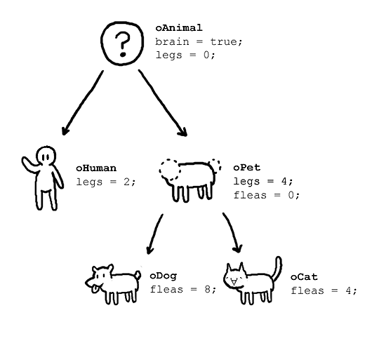

# 객체 지향 프로그래밍(Object Oriented Programming) 한눈에 보기
> 객체지향 프로그래밍은 추상화, 캡슐화, 정보은닉, 상속, 등 시스템의 복잡성을 제어할 수 있는 다양한 장치들을 제공한다.
> 
- 어느 객체지향 개발자가&nbsp&nbsp

    

- 컴퓨터 프로그램을 **"객체(Obejct)"** 들의 모임으로 파악하고자 하는 프로그래밍의 패러다임이며
- 각 객체들은 데이터를 주고받을수 있고 데이터를 처리 할 수 있다.

### OOP의 장점
**강한 응집력(Stoing Cohesion)과 약한 결합력(Weak Coupling)을 지향한다.**  

클래스에 하나의 문제 해결을 위한 데이터를 모아 놓은 객체를 활용한 프로그램을 지향하므로 응집력 강화하며,  
클래스 간에 독립적으로 디자인함으로써 결합력을 약하게 할 수 있다.
- 프로그램을 **유연하고 변경이 용이하게 만든다.**
- 프로그램의 **개발과 보수를 간편하게 만든다.**
- **직관적인 코드 분석**을 가능하게 한다.

#### 결합력(coupling)
: 프로그램의 코드의 한 종류가 다른 것이 얼마나 결합되어 있는지, 얼마나 의존적인지 나타내는 정도

- 결합력이 낮다는 것은 한 요소가 다른 요소들과 관계를 크게 맺고 있지 않은 상태를 의미한다.
- 결합력이 낮으면 변경의 용이하다.
 
#### 응집력(Cohesion)
: 프로그램의 한요소가 해당 기능을 수행하기 위해 얼마만큼의 연관된 책임과 아이디어가 뭉쳐있는지 나타내는 정도

- 프로그램의 한 요소가 특정 목적을 위해 밀접하게 연관된 기능들이 모여서 구현되어있다.
- 지나치게 많은 일을 하지 않으면 "응집력이 높다." 라고 표현  
    >응집도가 높으면 프로그램을 쉽게 이해할 수 있음

### 객체의 3요소
#### 상태 유지(객체의 상태)
- 객체는 상태 정보를 저장 및 유지해야한다.
- 이러한 속성(Variable)은 변수로 정의되어야 한다.
- 속성값이 바뀜으로, 객체의 상태가 변경 될 수 있어야 한다.

#### 기능 제공(객체의 책임)
- 객체는 기능을 제공해야 한다. &rarr; Method의 재공
- 외부로 부터 직접 속성에 접근하여 변경 하는것이 아닌  
 객체가 제공하는 method로 기능이 제공되어야한다.

#### 고유 식별자 제공(객체의 유일성)
- 각각의 객체는 고유한 식별자를 가져야한다.
- 예를들면 카드번호, 계좌번호 등...
- DB로 예를들면 PK, Uniqeu Key 등이 해당된다.

### OOP의 기본 구성 요소
#### 클래스(Class)
: 어떤 문제를 해결하기 위한 데이터를 만들기기 위해 추상화를 거쳐 집단에 속하는 속성(attribute)과 행위(behavior)를 변수와 메서드로 정의한 것
- 같은 종류의 집단에 속하는 속성과 행위 정의한 것이다.
- 다른 클래스와 독립적으로 디자인해야 한다.
- 필드, 매서드, 생성자로 이루어져 있다.
#### 객체(Object)
: 클래스의 인스턴스(Instance) 즉, 클래스라는 설계도를 구현한 것이라 할 수 있다.
- 상위 클래스의 속성을 가지고 있다
- 개별적인 특성과 행위(Method)를 가지고 있다.
#### 메서드(Method)
: 클래스 내부에 정의된 함수를 말한다.
- 클래스로부터 생성된 객체를 사용하는 방법
- 객체의 속성을 조작하는데 사용

### OOP의 특성
#### &nbsp; 캡슐화(Encapsulation)
> 캡슐화를 제대로 하면 정보 은닉(data hiding)은 자연스럽게 따라온다.
- 객체의 속성(data fields)과 행위(메서드, methods)를 하나로 묶는다.
  > 무작전 묶는게 아니라 **객체가 맡은 역할을 수행하기 위한 하나의 목적으로 묶는다**
- 실제 구현 내용 일부를 외부에 감추어 은닉한다. &rarr; 객체가 제공해야하는 필수적인 로직만 외부에 공개한다.
- 데이터를 절대로 외부에서 직접 접근을 하면 안되고 오로지 함수를 통해서만 접근해야한다.
  > 이를 위해 주로 필드는 private나 protected를 사용해서 접근을 제한한다.
- 접근지정자 ex) public, private, protected, default

#### &nbsp; 추상화(Abstraction)
: 공통의 속성이나 기능을 묶어 이름을 붙이는 것
> 객체 지향적 관점에서 클래스를 정의하는 것을 바로 추상화라고 정의 내릴수 있다.

- 객체들이 가진 공통의 특성들을 파학하고 불필요한 특성들을 제거하는 과정
- 객체들이 가진 동작들을 기준으로 이용자들이 동작만 쉽게 구동할 수 있도록한다.

#### &nbsp; 상속(Inheritance)
- 이미 정의 되어있는 상위 클래스와 메소드를 비롯한 모든 속성을 하위 클래스가 물려받는것
    >모든 클래스는 Object클래스를 상속받고 있다.
- 재사용, 유연성이 증가한다.

#### &nbsp; 다형성(Polymorphism)
- 한 요소에 여러 개념을 넣어 놓는 것
- 객체 관계를 조직적으로 나타낼 수 있다.
- ex) `@Overriding`을 통해 부모클래스의 method를 자식이 제지정할 수 있다.

## SOLID - 객체지향 개발 5대 원리
### SRP:단일 책임 원칙(Single Responsibility Principle)
: 객체는 하나의 책임만을 맡아야 한다.
- 변화에 대한 유연성 확보
- 낮은 결합도, 높은 응집도 추구

### OCP: 개방-폐쇄 원칙(Open Closed Principle)
: 모듈은 확장에는 열려 있어야 하고 변경시에는 닫혀 있어야한다.  
- 상위 클래스 또는 인터페이스를 중간에 둠으로써, 자신의 변화에 대해서 폐쇄적이지만,  
&nbsp; 인터페이스는 외부의 변화에 대해서 확장을 개방해 줄 수 있다.
- 이러한 부분은 JDBC, Hibernate등 JAVA Stream(I,O) 에서 찾아볼 수 있다.

### LSP: 리스코프 치환 원칙(Liscov Substitution Principle)
: 자식 클래스는 언제나 자신의 부모 클래스를 대체 할 수 있다.
- 즉 인터페이스만 알면 구현체를 몰라도 사용 가능해야한다.
- 다형성

### ISP: 인터페이스 분리 원칙(InterFace Segregation Principle)
: 특정 클라이언트를 위한 인터페이스 여러 개가 범용 인터페이스 하나보다 낫다.
- 인터페이스를 다시 작게 나누어 만든다.
- 두 개 이상의 인터페이스가 필요한 경우 다중 인터페이스 상속으로 구현하는 것이 좋다.

### DIP: 의존성 역전 원칙(Dependency Inversion Principle)
: 프로그래머는 “추상화에 의존해야지, 구체화에 의존하면 안된다.”
- 상위, 하위 모듈은 모두 추상화에 의존해야 한다.
- 세부사항이 추상화에 의존해야한다.