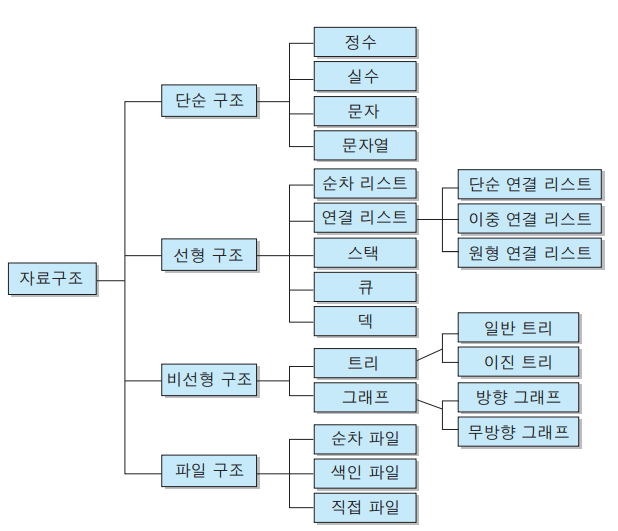

# 자료구조
: 효율적인 접근 및 수정을 가능케 하는 자료의 조직, 관리, 저장을 의미한다.
>더  데이터 값의 모임, 또 데이터 간의 관계, 그리고 데이터에 적용할 수 있는 함수나 명령을 의미한다.

#### 자료구조의 목표
- 데이터를 효율적으로 저장, 관리하여 메모리를 효율적으로 사용하기 위함이다.
- 적절한 자료구조의 사용은 메모리의 용량을 절약하고 실행시간을 단축 시킨다.

#### 자료구조의 선택기준
- 자료의 처리시간
- 자료의 크기
- 자료의 활용빈도
- 자료의 갱신정도
- 프로그램의 용이성

### 자료구조의 특징
#### 1. 효율성
- 적절한 자료구조를 선택후 사용한다면 **업무의 효율이 증가한다.**

#### 2. 추상화
> 추상화란 복잡한 자료, 모듈, 시스템 등으로 부터 핵심적인 개념만 간추려 내는 것
- 자료구조의 중요한 것은 어느 시점에 데이터를 삽입할 것이며, 어느 시점에 이러한 데이터를 어떻게 사용할 것인지 중요하다.
- 그렇기 때문에 **구현 외적인 부분에 시간을 더 쏟을 수 있다.**

#### 3. 재사용성
> 자료구조를 설계할때 특정 프로그램에서만 동작하게 설계하지 않는다.
- 다양한 프로그램에서 동작할 수 있도록 범용성 있게 설계한다.
  > 해당 프로젝트가 아닌 다른 프로젝트에서도 사용할 수 있다.

### 자료구조의 구성
- Insert : 데이터를 어떻게 저장 할 것인가
- Search : 데이터를 어떻게 탐색 할 것인가
- Delete : 데이터를 어떻게 삭제 할 것인가

### 자료구조의 분류

- 단순 구조: 프로그래밍에서 사용되는 기본 데이터 타입
- 선형 구조: 저장되는 자료의 전후관계가 1:1
- 비선형 구조: 데이터 항목 사이의 관계가 1:n 또는 n:m
- 파일 구조: 서로 관련된 필드들로 구성된 레코드의 집합인 파일에 대한 자료구조