# 연결 리스트 - Linked List
: 연결 리스트는 노드(node)들로 이어진 리스트를 말한다.  
#### 연결리스트의 예 - 단일 연결 리스트
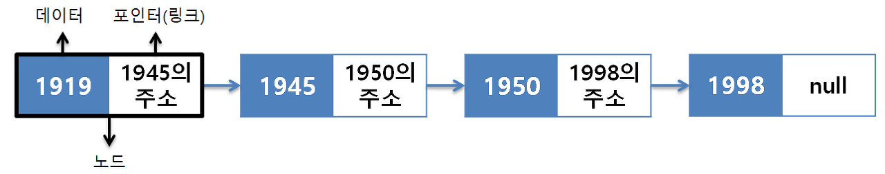

- 노드는 보통 데이터를 저장하는 부분과, 다음 노드를 가르키는 부분으로 구성된다.
- `연결 리스트`는 처음과 끝을 가르키는 포인터들을 이용해 리스트를 관리한다.
- `단일 연결리스트`, `원형 연결 리스트`, `이중 연결 리스트`가 있다.

#### 노드의 구조 예 - 단일 연결 리스트
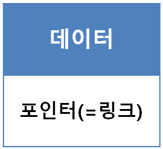

- 노드는 데이터를 갖고있는 데이터 필드와 리스트의 다음 원소를 가리키는, 링크필드(포인터)로 구성된다.

### 연결 리스트 특징
- 포인터로 연결한다.
  > 원소들이 메모리 내 어느 위치에도 가능
- 크기가 가변적이다.
  > 메모리가 허용하는 만큼 커질 수 있음
- 원소의 순서 유지되고, 순차 접근을 한다.
  > 원소의 순서는 링크를 이용하여 유지시켜 준다, 탐색시 순차적으로 접근해야 하므로 시간복잡도 `O(N)`을 가진다.
- 선형 리스트에 비해 구현이 어렵다.
  > 포인터의 저장 필요에 저장공간이 조금더 많이 소요되나, 빈공간을 거의 없게 할 수 있다.
- 다른 자료구조(추상자료형, ADT)의 기반이 된다.
  > 큐, 스택, 해시 테이블 등

### 연결 리스트 단점
#### 1. 캐싱에 적합하지 않은 구조
> 탐식시 연결 리스트보다 배열(순차 리스트)가 연결 리스트를 압도한다 이유가 무엇일까?

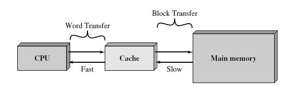

결론은 **컴퓨터에 있는 캐시(Cache)라는 저장 공간이 그 이유다.**  
1. `CPU`는 메인메모리에 적재(load)된 소스코드를 한줄씩 읽어서 처리하는데   
  `메인메모리(RAM)`의 경우 `CPU`에 비해 데이터 처리 속도가 압도적으로 느리다.
2. 때문에 `CPU`에서 작업을 완료해도 `RAM`에 있는 데이터나 소스코드가 전송되지 않아서 `CPU`가 오랜시간 대기하는 경우가 생긴다.
3. 이러한 문제를 해결하기 위해 이 둘 사이에 `캐시라는 저장공간`을 만들고 RAM에 적재된 정보 중 일부를 캐시에 미리 적재한다.
   > 캐시는 `SRAM기반`으로 `DRAM기반`의 `RAM`보다 훨씬 빠르다.
4. `CPU`는 `RAM`이 아닌 `캐시`에서 정보들을 가져오게 되고 이러한 `캐싱 방식`을 이용하면 `CPU`가 쉬는 시간을 극도로 줄일 수 있다.

왜 `연결 리스트`는 캐싱에 적합하지 않을까?
- `배열`: 같은 타입의 데이터들이 **연속된 메모리에 저장**되어 있어 이 데이터들을 한번에 캐시로 넘길 수 있다.
- `연결 리스트`: 데이터를 메모리 곳곳에 저장한 뒤, 이들을 주소로만 연결한 구조이기 때문에 데이터가 캐시로 한번에 넘어 올 수 없다.

#### 2. 복잡한 연산에 따른 오버헤드
: 일반적으로 배열리스트의 연산들보다 연결리스트의 연산들이 훨씬 복잡하다.
- 모든 연산을 수행할 때 더 많은 명령어가 필요하고 때문에 더 많은 오버헤드가 발생하게 된다.
- 알고리즘의 시간 복잡도 이외에도 추가적인 시간들이 소모된다.

#### 3. 주소 저장으로 인한 공간 낭비
: 데이터 이외에도 주소에 대한 정보를 반드시 가지고 있어야하기 때문에 주소에 대한 용량이 소모된다.
- 정수형 리스트의 경우 데이터(integer), 주소(integer)를 저장하기 때문에 배열리스트와 비교하여 2배의 용량이 필요하다. 
- 하지만 빈 값을 허용하지 않는다.

## 1. 단일 연결 리스트 - Singly Linked List
: 포인터를 통해 단방향으로 다음 노드를 가르키는 자료구조이다.  
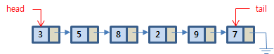

- 모든 원소가 데이터, 링크 쌍으로 이루어져 있다.
- 원소의 삽입과, 삭제가 용이하다.

### 삽입 / 삭제 연산
> 일반적으로 삽입/삭제 연산은 상수, `O(1)` 시간복잡도를 갖는다.  
> 하지만 현실적인 삽입/삭제 연산은 탐색이 포함되므로 결국 `O(1 + n)`즉, `O(n)`의 시간복잡도를 가진다.

#### 1. 맨 앞에 노드 삽입
> Head만 있으면 되므로 `O(1)`의 시간복잡도를 갖는다.
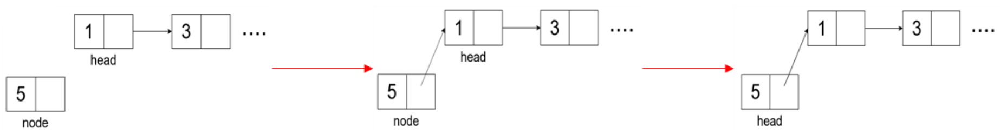

1. `새로운 노드`를 생성한다.
2. `새로운 노드`의 `링크`를 `헤더` 다음으로 가리키도록 한다.
3. `헤더의 링크`는 `새로운 노드`를 가르키게 한다.  

#### 2. 맨 뒤에 노드 삽입
> O`(n)`의 시간복잡도를 가진다.
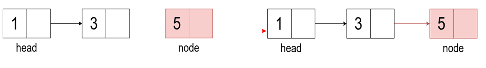

1. `새로운 노드`를 생성한다.
2. `마지막 노드`를 찾는다.
3. `마지막 노드`는 `새로운 노드`를 가르키게 한다

#### 3. 원하는 곳(index)에 노드 삽입
> 원하는 노드를 탐색 후 삽입하므로 시간복잡도 `O(n + 1)`즉, `O(n)`를 갖는다.

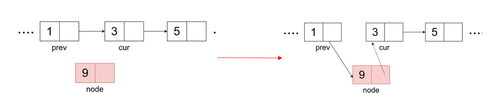

1. `새로운 노드`를 생성한다.
2. `특정 인덱스의 노드(cru)`와 그 `이전 노드(prev)`를 찾는다.
3. `prev`가 새로운 노드를 가르키고, `새로운 노드`가 `cur`를 가리키도록 한다.

#### 4. 특정 노드 삭제
> 원하는 노드를 탐색 후 삭제하므로 시간복잡도 `O(n + 1)`즉. `O(n)`를 갖는다.
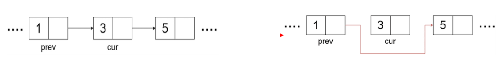

1. `삭제할 노드`를 없앤다.
2. `삭제할 노드`의 `이전 노드의 포인터`를 `삭제할 노드`의 `다음 노드`로 지정해주면 된다.

### 단일 연결 리스트의 단점
- 이전 리스트의 값을 확인하려면 다시한번 탐색을 해야 한다.

## 2. 원형 연결 리스트 - Circular Linked List
: 리스트의 마지막 노드(헤드)의 링크가 첫 번째 노드를 가리키는 연결 리스트이다.  
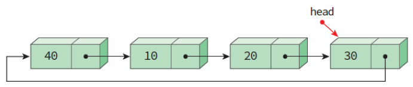

- `헤드`의 `링크(link)`는 리스트의 `첫 번째 노드`를 가르킨다.
  > 리스트의 처음이나 마지막에 노드를 삽입하는 연산이 편리해진다.

### 삽입 연산
#### 1. 앞부분 삽입 연산 - `Head`다음 위치에 삽입
> 시간복잡도는 `Head`만 알고 있으면 되므로 탐색이 필요하지 않아 `O(1)`이다.

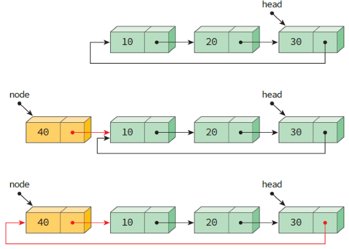

1. 새로 삽입할 `node`의 `link`를 `head`의 `link`로 할당
   > `head`는 리스트의 삽입 이전 첫번째 노드의 포인터를 가지고 있기 때문
2. `head`의 `link`를 `node`로 할당

**순서가 변경되면 안된다. 만약 2를 먼저 실행하면 새로 삽입할 `node`의 `link`를 지정할 주소를 알지 못한다.**

#### 2. 뒷부분 삽입 연산
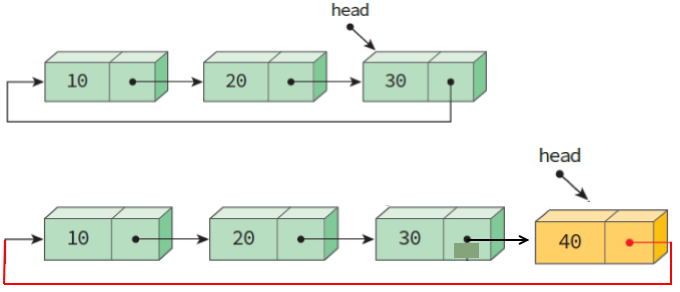

1. `node`의 `link`를 `head`의 `link`로 할당
2. `head`의 `link`를 `node`로 할당
   > `head`는 리스트의 제일 마지막 노드를 의미하므로
3. `head`를 `node`로 변경

**순서가 변경되면 안된다. 2과정이 먼저 일어나면 지정할 주소를 잃어버리게 된다.**

#### 3. 원하는 곳(index)에 노드 삽입
[단일 연결리스트의 3번 삽입 연산과 같다.](#3-원하는-곳index에-노드-삽입)
다만 head가 맞는지 아닌지 예외처리를... 해야 할 것이다(뇌피셜)

### 삭제 연산
[단일 연결리스트의 4번 삭제 연산과 같다.](#4-특정-노드-삭제)

## 3. 이중 연결 리스트 - Doubly Linked List
: 각 노드가 선행 노드와 후속 노드에 대한 링크를 가지는 리스트이다.
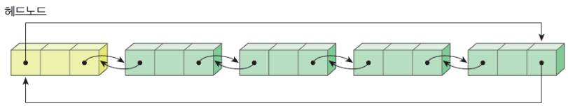

- 노드의 `왼쪽 링크(left link)`는 `현제 노드`의 `왼쪽 노드`를 가르킨다. 
- 노드의 `오른쪽 링크(right link)`는 `현재 노드`의 `오른쪽 노드`를 가르킨다.
- `헤드노드`도 노드로 이루어져 있다.
- 노드가 양방향으로 연결되어 있으므로 **탐색도 양방향이 가능하다.**
- 하지만 **노드의 포인터는 단일 연결 리스트에 비해 1개 더 늘어난다.**

>참고. `right link` == `previous link`, `left link` == `next link`

#### 헤드노드 - head Node
: 데이터를 가지지 않고 오로지 삽입, 삭제 코드를 간단하게 할 목적으로 만들어진 노드이다.
- 헤드 포인터만의 구별이 필요하다. &rarr; `헤드노드`에는 데이터가 없다.
- 리스트가 공백상태라면 `헤드노드`만 존재하는 상태이다.
- `왼쪽 링크(left link)`: 리스트의 마지막 노드를 가리킨다
- `오른쪽 링크(right link)`: 리스트의 맨 첫번째 노드를 가리킨다.

### 삽입 연산
> `new_node`를 `before`의 앞쪽에 삽입하는 연산  
> 시간 복잡도: 특정노드의 위치를 정확하게 알면 `O(1)`, 탐색이 필요하면 `O(n + 1)` 즉, `O(n)`

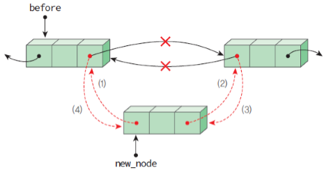

> 이상적인 순서는 1 &rarr; 2 &rarr; 3 &rarr; 4 이지만 순서마다 차이가 날 수 있다.
1. `new_node`의 `left link`가 `before`를 가리킨다.
2. `new_node`의 `right link`가 `before`의 `rlink`를 가리킨다.
3. `before`의 `right link`의 `left link`가 `new_node`를 가르킨다.
4. `before`의 `right link`는 `now_node`를 가르킨다.

**2, 3번은 무조건 4번 앞에 수행되어야 한다.**

필요한 예외 처리 - 선행자를 찾을 수 없을때 즉, 해당 리스트가 없을 때(초기화 x)

### 삭제 연산
> 삭제하려는 노드를 `removed`변수로 받아서 삭제 연산을 수행한다.  
> 시간 복잡도: 특정노드의 위치를 정확하게 알면 `O(1)`, 탐색이 필요하면 `O(n + 1)` 즉, `O(n)`

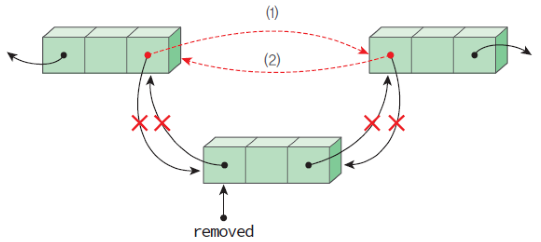

> 순서는 상관 없다.
1. `removed`의 `left link`는 `removed`의 `right link`를 가르킨다.
   > 삭제할 노드의 이전 노드가 없을 때
2. `removed`의 `right link`는 `removed`의 `left link`를 가르킨다.
   > 삭제할 노드의 다음 노드가 없을 때