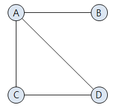

# 그래프 - Graph
`그래프 - Graph`란 요소들이 서로 복잡하게 연결되어 있는 관계를 표현하는 자료구조이다.

### 용어 정리

#### 정점 - vertex
`노드 - node`라고하며 데이터가 저장되는 그래프의 기본 원소이다.

#### 간선 - edge
`링크 - link`라고하며 정점 간의 관계를 나타낸다

#### 인접 정점 - adjacent vertex
하나의 정점에서 간선에 의해 직접 연결되어 있는 정점을 뜻한다.
> 위 그래프에서 정점 `C`의 인접 정점은 `A`, `D`이다.

#### 차수 - degree
정점에 연결된 간선의 수
> 정점 A의 차수는 3이고 모든 정점의 차수를 합하면 8이다.

- 무방향 그래프에서 하나의 간선은 두 개의 정점에 인접하기 때문에 간선 수에 2배를 해주면 된다.
- 방향 그래프의 경우 외부에서 오는 간선의 수를 `진입 차수 - in-degree`라고 하며, 
- 외부로 향하는 간선의 수를 `진출 차수 - out-degree`라고 한다.

#### 경로 - path
간선을 따라갈 수 있는 길을 말하며, 정점을 나열하여 표시한다.

#### 경로의 길이 - length
경로를 구성하는 데 사용된 간선의 수를 뜻한다.

#### 단순 경로 - simple path
경로 중 반복되는 간선이 없는 경로

#### 사이클 - cycle
시작 정점과 종료 정점이 같은 단순 경로를 뜻한다.

### 그래프 ADT
#### 객체
정점의 집합과 건선의 집합

#### 연산
- `create()` : 그래프 생성
- `insertVertex(v)` : 그래프에 정점 v 삽입
- `insertEdge(u, v)` : 그래프에 u정점과 v정점을 연결하는 간선 삽입
- `deleteVertex(v)` : 그래프에서 정점 v 삭제 (v에 연결된 모든 간선도 함께 삭제)
- `deleteEdge(u, v)` : 그래프에서 u정점과 v정점을 연결하는 간선 삭제
- `adjacent(v)` : 정점 v에 인접한 모든 정점을 반환

## 구현 방법
`인접 행렬`, `인접 리스트` 로 구현할 수 있다.

### 1. 인접 행렬 - Adjacency Materix

#### 장점
- 두 점에 대한 연결 정보를 조회할 때 `O(1)`시간복잡도를 가진다.
  > 2차원 배열 속 모든 정점들의 간선 정보를 담는다.
- 정점(i)의 차수를 구할 때는 다음과 같이 인접행렬(M)의 i번째 행의 값을 모두 더하면 되므로 `O(n)`의 시간복잡도를 가진다.  
$$degree(i)= \sum_{k=0}^{n-1} M[i][k]$$

- 구현이 비교적 간단하다.

#### 단점
- **모든 간선의 수를 알아내려면** 모든 정점에 대해 간선 정보를 대입해야 하므로 `O(n²)`의 시간복잡도를 가진다.
- 무조건 2차원 배열이 필요하여 필요 이상의 공간이 낭비된다.

### 2. 인접 리스트

#### 장점
- 정점들의 **연결 정보를 탐색할 때 `O(n)`의 시간복잡도를 가진다.** `n = 간선의 갯수`
- 필요한 만큼의 공간만 사용하기 때문에 공간의 낭비가 적다.

#### 단점
- **두 정점을 연결하는 간선을 조회**하거나 **정점의 차수를 알기** 위해서는 정점의 인접 리스트를 탐색해야 하므로 정점의 차수만큼의 시간이 필요하다. `O(degree(v))` `v = 정점`

- 구현이 비교적 어렵다.

### 3. 인접 행렬 vs 인접 리스트

- 정점의 개수에 비해 간선의 개수가 매우 적은 **희소 그래프에서는 인접 리스트**가 유리할 수 있다.
- 모든 정점간에 간선이 존재하는 **완전그래프 에서는 인접 행렬**이 유리할 수 있다.

다음글 [트리 - tree](../tree/tree.md)

## Reference
- https://suyeon96.tistory.com/32#---%--%EA%B-%B-%EB%-E%--%ED%--%--%--%EC%-A%A-%EC%--%B-
- https://coding-factory.tistory.com/610