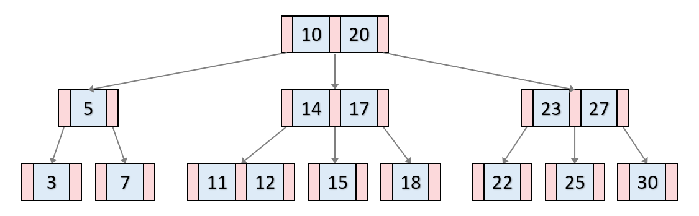

# B-Tree
이진트리에서 발전되어 **모든 리프노드들이 같은 레벨을 가질 수 있도록 자동으로 벨런스를 맞추는 트리**이다.
- 정렬된 순서를 보장한다.
- 멀티레벨 인덱싱을 통한 빠른 검색을 할 수 있다.

> DB에서는 B트리에서 발전된 B+트리를 사용한다.

### B-Tree의 조건
B트리는 이진트리와 다르게 하나의 노드에 많은 수의 정보를 가질 수 있다.

**최대 M개의 자식**을 가질 수 잇는 B트리를 `M`차 B트리라고 하며 다음과 같은 특징을 같는다.
- 노드는 `최대 M`개 부터 `M / 2`개 까지의 자식을 가질 수 있다.
- 노드에는 최대 `M - 1`개 부터 `(M / 2) - 1`개의 키가 포함될 수 있다.
- 노트의 키가 `x`개라면 자식의 수는 `x + 1`개 이다.
- 최소차수는 자식수의 하한값을 의미하며, 최소차수가 `t`라면 `M = 2t - 1`을 만족한다.
  > `최소차수 t`가 2라면 `3차 B트리` 이며, key의 하한은 1개이다.

### B-Tree의 예시
다음은 차수가 3인 B트리이다.
- 파란색: 각 노드의 Key
- 빨간색: 자식 노드를 가르키는 포인터

1. key들은 노드 안에서 항상 정렬된 값을 가진다
2. 이진 검색 트리처럼 자식들은 항상 key보다 작은값을 가지고, 오른쪽은 큰 값을 가진다.
3. 키마다 value를 가지고 있다.
   > 아래 그림에서는 생략되었다.

## 검색 & 삽입 과정
https://velog.io/@emplam27/자료구조-그림으로-알아보는-B-Tree

### 1. key 검색과정
루트노드에서 시작하여 하향식으로 검색을 수행한다.

1. 루트 노드에서 시작하여 **key들을 순회**하면서 검사한다.
   1. 만일 k와 같은 key를 찾았다면 검색을 종료한다.
   2. 검색하는 값과 key들의 대소관계를 비교하여 어떠한 key들 사이에 k가 들어간다면 해당 key사이의 자식노드로 내려간다.
2. 해당 과정을 리프노드에 도달할 때까지 반복한다.
   1. 만약 리프노드에도 k와 같은 key가 없다면 검색을 실패한다.

### 2. 삽입과정
1. 트리가 비어있으면 루트 노드를 할당하고 k를 삽입한다.
   1. 만약 루트노드가 가득 찼다면 노드를 분할하고, 리프노드가 생성된다.
2. 이후부터는 삽압하기에 적절한 리프노드를 찾아 k를 삽입한다.
   > 삽입위치는 노드의 key값과 k값을 검색 연산과 동일한 방법으로 비교하면서 찾는다.
