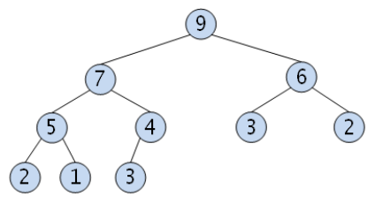
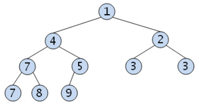

# 힙 - Heap
> `힙 - heap` = `이진 힙 - binary heap` 

최댓값 및 최솟값을 찾아내는 연산을 빠르게 하기 위해 고안된 `완전 이진트리 - complete binary tree`를 기반으로 한 자료구조이다.

- `우선순위 큐 - Priority Queue`를 구현하기 위해 만들어졌다.
- `이진 탐색 트리 - BST`와 달리 중복된 값을 허용한다.
- 높이는 `log(n + 1)`
- 삽입/삭제/조회의 시간 복잡도 `O(logn)`

### 종류
#### 최대 힙 - Max Heap
부모 노드의 키 값이 자식 노드보다 크거나 같은 완전 이진 트리 이다.
> 부모노드 >= 자식노드

#### 최소 힙 - Min Heap
부모 노드의 키 값이 자식 노드보다 작거나 같은 완전 이진 트리 이다.
> 부모노드 <= 자식노드

