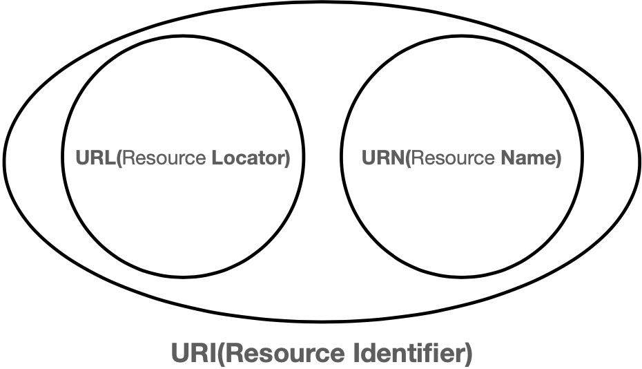

# URI?, URL?, URN?
<p align="center"></p>

## URI - Uniform Resource Idntifier
: **통합 자원 식별자(ID), 정보 리소스를 고유하게 식별하고 위치를 지정함**  
- URI의 두가지 형태 ``URL, URN``가 있다. **즉 URL, URN은 URI의 부분집합**  
- URI의 존재는 인터넷에서 요구되는 기본조건으로 인터넷 프로토콜이 항상 붙어다님  
    (ex. http://www.naver.com)
- 응답은 달라질수 있다. (.pdf, docx)

#### 단어 뜻
- Uniform: 리소스를 식별하는 통일된 방식
- Resource: 자원 URL로 식별할 수 있는 모든것 - 제한x
- Identifier: 다른 항목과 구분하는데 필요한 정보

## URL - Uniform Resource Locator
: **특정 서버의 한 리소스에 대한 구채적인 위치 서술**  
- URL은 리소스가 정확히 어디에 있고 어떻게 접근할 수 있는지 분명히 알려준다.
- 웹사이트 주소가 요청하는 파일이라기보다는 구분자로 보는것
```
http://example.com/mypage.html - 실제 사이트 URL
```
```
http://img.naver.net/static/www/dl_qr_naver.png - 네이버 앱QR코드의 이미지에 대한 URL
```

### 문법
```http
scheme://[userinfo@]host[:port][/path][?query][#fragment]
https://www.google.com:443/search?q=hello&hl=ko
```
- scheme : 주로 프로토콜을 사용한다.
- userinfo : URL에 사용자정보를 포함해서 인증한다.
  > 거의 사용하지 않는다.
- host : 도메인 or IP
- port : port번호
- path : 리소스 경로, 계층적 구조
- query : `key=value` 형태
  > query parameter, query string등으로 불림
- fragment : html 내부 북마크 등에 사용하고, 서버에 전송하는 정보가 아니다.
- http 80포트, https 443포트는 생략할 수 있다.

## URN - Uniform Resource Name
: **콘텐츠를 이루는 한 리소스에 대해, 그 리소스의 위치에 영향 받지 않는 유일무이한 이름**  
- 리소스가 그 이름을 변하지 않게 유지하는 한, 여러종류의 네트워크 접속 프로토콜로 접근해도 문제가 없다.
- 노출된 URL은 http://blog.com/work/222 인데, http://blog.com/work/list/222 으로 보내면 404 response를 받는다. 이를 보완하기위해 위치 정보와 무관한 리소스를 찾게 해주게 하는 방식
- 해당 리소스의 위치정보가 아닌 실제 리소스의 이름으로 사용하는 방식
(ex. urn:2.19.222 )
```
urn:isbn:0451450523 - URN으로 1926년에 출간된 the Last Unicorn의 도서식별번호
```
```
urn:oid:2.16.840 - URN으로 미국을 의미하는 OID이다
```