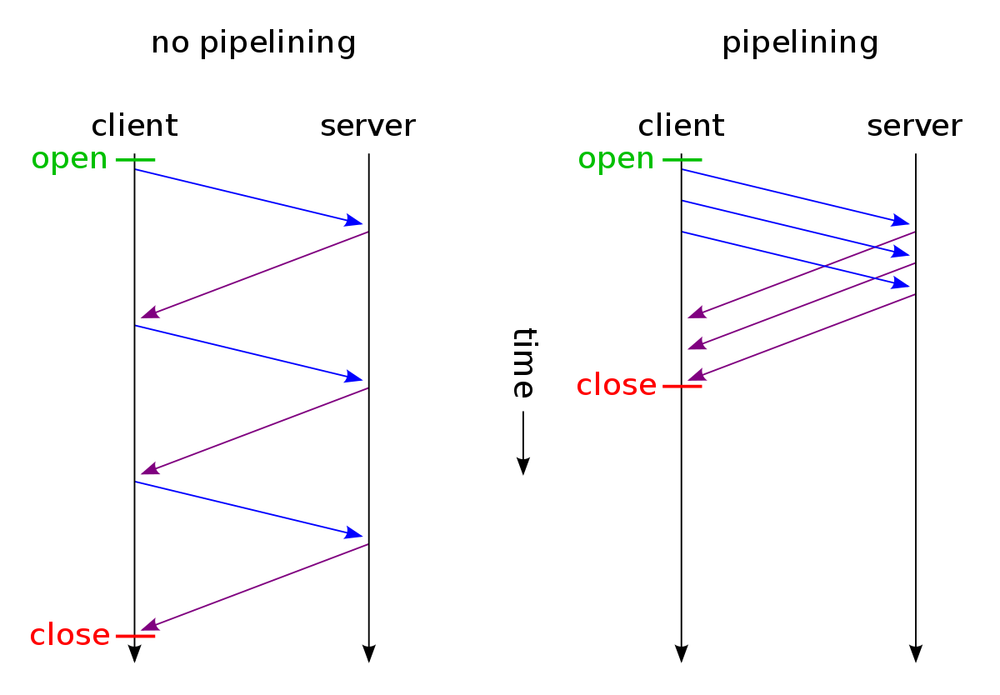

# HTTP 버전별 차이
## 1. HTTP 0.9
- HTTP의 초기 버전은 버전 정보가 없었다.
  > 차후 버전 구분을 위해 0.9라고 불리게 되었다.
- 단순히 GET 통신만 가능하다.
- HTTP 해더가 없기 떄문에 데이터 전송은 HTML문서만 가능하고
- 오류 코드가 없었기 떄문에 문제 상황시 해당 파일 내부에 문자에 대한 설명을 포함하여 보내졌다고 한다.

## 2. HTTP 1.0
- 상태코드가 응답값 시작 부분에 포함되어 요청에 대한 성공과 실패를 확인할 수 있다.
- HTTP 헤더가 요청/응답 모두 추가되어 프로토콜의 확장이 가능하다.
  > 해더의 `Content-Type`의 도움으로 HTML 파일 이외 다른 문서도 전송이 가능하다.
- POST, HEAD가 추가되었다.
- Connection 특성 : 응답 직후 종료

## 3. HTTP 1.1
**HTTP의 첫 번쨰 표준 버전이다.**
- `PUT`, `DELETE`, `OPTIONS`, `TRACE` 메서드가 추가되었다.
- 추가적으로 여러 헤더값도 추가되었다.
  > 예시.  
  > ```http
  > Via : 중계서버(프록시, 게이트웨이 등)의 지원 프로토이름.버전.호스트명 (ex. via: 1.1 123abc. cloudfront.net (CloudFront))
  > Accept : 클라이언트의 사용가능 미디어타입 (ex. application/json, text/plain, */*)       
  > ```

### 3-1. 커넥션 유지 - Persistent Connection (Keep Alive와 Pipeline)

#### 1. Keep Alive
HTTP는 TCP 연결 기반 위에서 동작하는 프로토콜이다. TCP는 신뢰성 확보를 위해 연결을 맺고 끊을 때 `handshake`가 이루어 진다. (`3-way-handshake`, `4-way-handshake`)   
HTTP는 비 연결성 프로토콜이기 떄문에 한번 연결로 한번의 요청 후 응답을 하고나면 연결을 끊어버린다. 이러면 오버헤드가 커질 수 있어 HTTP/1.1에서 Kepp-alive기능이 추가되었다.

#### 1-1. Keep-alive란?
이미 연결되어 있는 TCP 연결을 재사용하여
한 번 맺어졌던 연결을 끊지 않고 지속적으로 유지하여 불필요한 핸드 셰이크를 줄여 성능을 개선할 수 있다.
keep-alive 응답의 예제
```http
HTTP/1.1 200 OK
Connection: Keep-Alive
Keep-Alive: timeout=5, max=1000
```


#### 1-2. 주의사항
하나의 커넥션으로 여러 요청과 응답을 처리할 수 있지만...
모든 TCP 세션을 무한정 유지할 수는 없으므로 timeout과 max설정을 잘 설정해야 한다.

추가적으로 Nginx와 같이 Event-driven 구조여서 non-blocking을 사용하는 웹서버는
Keep Alive를 하면서도 Thread를 점유하지 않기 때문에 동시 처리에 유리하다.


Keep Alive는 https://goodgid.github.io/HTTP-Keep-Alive/#http10 여기에서 잘 알려주는 거 같아 첨부한다.

#### 커넥션 유지의 장점
응답 속도 개선, TCP 세션 처리 부하 감소

#### 2. 파이프라이닝 - Pipelining


HTTP 요청은 순차적으로 이루어 진다.

파이프라이닝은 응답을 받지 않아도 순차적으로 요청을 보내고 이에 대한 각각의 응답을 받아 응답 속도를 높힌다.

### 3-2. 호스트 헤더 - Host Header
HTTP 1.1에서 Host Header의 추가로 버츄얼 호스팅이 가능해졌다.

> **`버추얼 호스팅 - virtual hosting`이란?**  
> 하나의 서버에 여러개의 도메인 이름을 호스팅하는 방식을 말한다.

이로 인해 하나의 IP에 여러개의 도메인을 운영할 수 있게 되었다.

### 3-3. 강화된 인증 절차
실제 서버에서 클라이언트 인증을 요구하는 `www-authentication` 헤더는 서버 사이에 프록시가 위치하는 경우 프록시가 사용자의 인증을 요구할 수 있는 방법이 없었다.

HTTP/1.1에서 다음 2개 해더가 추가되어 프록시가 클라이언트에게 인증/인가 요청을 할 수 있다.
- `proxy-authentication`
- `proxy-authorization`

### 3-4. HTTP 1.1의 단점

#### 1. HOL - Head Of Line Blocking - 특정 응답의 지연
Connection을 통해서 다수개의 파일을 요청/응답 받을 수 있는 기법인 `pipelining` 기법을 통해 성능을 향상할 수 있지만. 한가지 문제가 있다.

하나의 TCP연결에서 3개의 이미지를 얻으려고 하는 경우 HTTP 요청 순서는 다음과 같다.
```
| --- a.png --- |

                | --- b.png --- |

                                | --- c.png --- |
```
순서대로 첫번째 이미지를 요청하고 응답받고 다음 이미지를 요청하게 되는데 만약 첫번째 이미지를 요청하고 응답이 지연되면,  
아래 그림과 같이 두,세번째 이미지는 당연히 첫번째 이미지의 응답처리가 완료되기 전까지 대기하게 되며 이와 같은 현상을 HTTP의 `Head of Line Blocking`이라고 한다.
```
| ------------------------- a.png --------------------- |

                                                        | -b.png- |

                                                                  | --c.png-- |
```

#### 2. RTT - Round Trip Time 증가
HTTP 1.1은 일반적인 경우 하나의 connection에 하나의 요청을 한다. 이렇다 보니 매 요청마다 `3-way-handshake`가 반복적으로 일어나고 불필요한 RTT증가와 네트워크 지연을 초례한다.

#### 3. 무거운 Header 구조
http/1.1의 헤더에는 많은 메타정보들이 저장되어 있다.

- 사용자가 방문한 웹페이지는 다수의 요청이 발생하는데, 이 경우 **매 요청시 중복된 헤더값을 전송**한다.
- 요청을 통해서 전송하려는 페이로드보다 헤더 값이 더 큰 경우도 있다.


## 4. HTTP 2.0
기존 HTTP 1.1에 비해 성능 향상에 초점을 둔 버전이다.

다음은 HTTP2에 대한 소개글을 일부 가져왔다. https://http2.github.io/
> HTTP/2 is a replacement for how HTTP is expressed “on the wire.” It is not a ground-up rewrite of the protocol; 
> HTTP methods, status codes and semantics are the same, and it should be possible to use the same APIs as HTTP/1.x (possibly with some small additions) to represent the protocol.

> **The focus of the protocol is on performance**; 
> specifically, end-user perceived latency, network and server resource usage. 
> One major goal is to allow the use of a single connection from browsers to a Web site.


HTTP 2.0은 HTTP 1.1에 대한 높은 호환성을 보여주며, 성능향상을 가져왔다.
- 기존 `평문 - Plain Text`을 사용하던 HTTP 1.x와 달리 HTTP 2.0은 바이너리 포멧으로 인코딩된 Message, Frame으로 구성된다.

- `Stream`  : 구성된 연결 내에서 전달되는 바이트의 양방향 흐름
  > 하나 이상의 메시지를 전달 할 수 있다.
- `Message` : 논리적 요청 또는 응답 메시지에 매핑되는 프레임의 전체 시퀀스다.
- `Frame`   : Http/2.0에서의 통신의 최소 단위 
  - 이 프라임 헤더는 최소한으로 프레임이 속하는 스트림을 식별한다.
  - `Headers Type Frame`, `Data Type Frame`이 존재한다.

### 4-1. Multiplexed Streams
- 한 Connection으로 동시에 여러 개 메시지를 주고 받을 수 있으며, 
- Response는 순서에 상관없이 stream으로 주고받는다.

### 4-2. Prioritization
- 리소스간 우선순위를 설정한다.

### 4-3. Server Push
- 서버는 클라이언트의 요청에 대해 요청하지 않은 리소스를 마음대로 보내줄 수 있다.
    > 즉, 클라이언트가 요청하기 전에 필요하다고 예상되는 리소스를 Server에서 먼저 요청한다.

### 4-4. Header Compression


- 이전 Header의 내용과 중복되는 필드를 재전송하지 않아 데이터를 절약한다.
- Header table과 Huffman Encoding 기법(HPAC 압축방식)을 이용해 헤더를 압축한다.

## HTTP 1.0 vs HTTP 1.1 vs HTTP 2.0


## Reference
- https://falsy.me/http의-버전-별-차이에-대해-알아보고-ubuntu-nginx에-http-2를-적용해/
- https://withbundo.blogspot.com/2021/02/http-http-10-http-11.html
- https://www.popit.kr/나만-모르고-있던-http2/