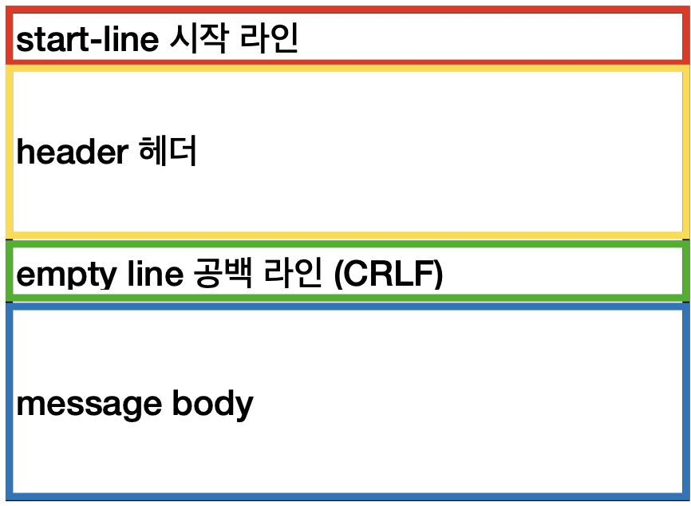
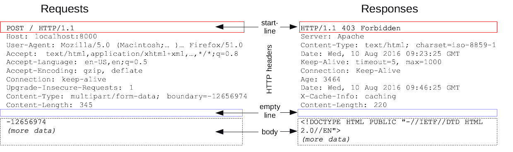

# HTTP - Hyper Text Transfer Protocol
: 인터넷에서 데이터를 주고받을 수 있는 프로토콜
- 구성요소: Client, Web Server, Proxy
- 80 PORT를 기본으로 사용한다.
  > https는 443

### 특징
- `HTML`, `XML`, `JSON`등 컴퓨터에서 다룰 수 있는 모든 형식의 파일은 전송 가능하다.
- 무상태 프로토콜이다. - Stateless
  > 이전 데이터 요청과 다음 데이터 요청이 서로 관련이 없다.
- 클라이언트 서버 구조
- 단순하며 확장 가능하다.

## 통신 방식
### 1. 요청(request) - 응답(response) 방식

- Request Response 구조
- 클라이언트는 서버에 요청을 보내고, 응답을 대기한다.
- 서버가 요청에 대한 결과를 만들어 응답한다.

클라이언트와 서버가 분리되었다는 것이 중요하다.  
서버는 비즈니스 로직과 데이터에 대해 집중할 수 있고, client는 UI/UX에 집중할 수 있어 서로 독립적으로 진화할 수 있다.

### 2. 비상태성 - Stateless
: HTTP는 요청하고 응답을 하면 요청을 끊어버린다.
- 확장성이 높다.
- 응답 서버를 쉽게 바꿀 수 있다.

#### 2 - 1. 한계점  
- 이전에 통신한 정보를 알 수 없다.
  > 쿠키, 세션으로 해결한다.

### 3. 비 연결성 - Connectless
- HTTP는 기본적으로 연결을 유지하지 않는 모델이다.
- 서버 자원을 매우 효율적으로 사용할 수 있다.
  > 매우 많은 유저가 서비스를 사용해도 실제 서버에서 동시에 처리하는 요청을 수십개 이하로 매우 작다.

#### 3 - 1. 한계점
- TCP/IP 연결을 새로 맺어야 한다.
  > 3 way handshake 시간 추가
- HTML, JS, CSS, 추가 이미지 등 수 많은 자원이 함께 다운로드 된다.

이러한 문제를 HTTP-지속-연결(Persistent Connections)로 문제를 해결했고, HTTP/2, HTTP/3에서 더 많은 최적화가 되었다.

# HTTP 메시지
| **HTTP 메시지 구조** | HTTP 메시지 예제 |
|--------------------------|---------------|
|| |

## 1. 시작줄

### 1 - 1. 요청 - Request
구조는 다음과 같다
```md
method SP(공백) request-target SP HTTP-version CRLF(줄바꿈)

#### 예시
GET /search?q=hello&lang=ko HTTP/1.1
```
#### method - 메서드
서버가 수행해야 할 동작을 지정하는 역할이다.
- 종류: GET, POST, PUT, DELETE등...

#### request-target - 요청 대상
- 주로 절대경로(`/`)로 시작한다.
- 다른 방식으로 표기할 수 있다.

#### HTTP-version
HTTP의 버전을 나타낸다.

### 1 - 2 응답 - Response
구조는 다음과 같다.
```md
HTTP-version SP status-code SP reason-phrase CRLF

#### 예시
HTTP/1,1 200 OK
```
#### reason-phrase
사람이 이해할 수 있는 짧은 상태 코드 설명 글

#### 주요 Status Code(상태코드)
> 자세히는 [MDN HTTP 상태 코드](https://developer.mozilla.org/ko/docs/Web/HTTP/Status) 에 나와있다.
- **1xx (조건부 응답)**: 요청을 받았으며 작업을 계속한다.  
- **2xx (성공)** : 클라이언트가 요청한 동작을 이해했고 승락했으며 성공적으로 처리했음을 가르킴
- **3xx (리다이렉션 만료)**: 클라이언트는 요청을 마치기 위해 추가 동작을 취해야 한다.
- **4xx (요청오류)**: 클라리언트에 오류가 있음을 나타낸다.
- **5xx (서버오류)**: 서버가 유효한 요청을 명백하게 수행하지 못했음을 나타낸다.


## 2. Header
### 2 - 1. 구조
```md
field-name ":" OWS field-value

#### 예시
GET /search?q=hello&lang=ko HTTP/1.1
Host: www.google.com
```
> OWS(뛰어쓰기 허용)
- filed-name은 대소문자 구분하지 않는다.

### 2 - 2. 용도
HTTP 전송에 필요한 모든 부가정보를 담는 용도
- 인증, 브라우저 정보, 캐시 관리 정보 등...
- 표준 헤더가 너무 많다.
- 임의의 헤더를 추가할 수 있다.
  > hello: hi

## 3. HTTP Message Body
실제 전송할 데이터를 담고 있다. (playload)
- byte로 표현 가능한 모든 데이터를 전송할 수 있다.
  > HTML, JSON, XML, 이미지, 영상 등...

다음글: [더 좋은 API를 설계하는 방법](http-api-design.md)