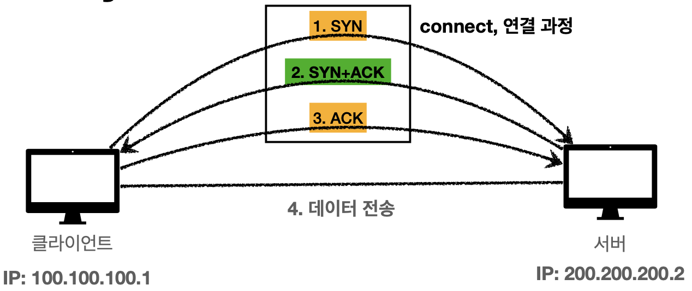

# TCP - Trancmission Control Protocol
> 신뢰할 수 있는 프로토콜이며 현재 대부분 사용하고 있다.

### 특징
#### 1. `Trancmission - 연결지향` - TCP 3 way handshake (가상연결)
3번의 요청으로 `클라이언트`와 `서버`모두 데이터를 전송할 준비가 완료되었다는 것을 보장하는 과정이다.  

1. `클라이언트`는 `서버`에게 접속 요청(SYN)을 한다.
2. `서버`는 `클라이언트`의 요청을 수락(ACK)하고, `클라이언트`에게 접속을 요청(SYN)을 한다.
3. `클라이언트`는 서버의 요청을 수락(ACK)한다.
   > ACK메시지와 함께 데이터를 전송할 수 있다.
4. 데이터를 전송한다.

TCP 3 way handshake를 통해 클라이언트와 서버는 **논리적으로 연결된다.** 

#### 2. 데이터 전달 보증
데이터가 제대로 전송되었는지 서버에서 응답을 한다.

#### 3. 순서 보장
패킷의 전송 순서를 보장한다.

TCP/IP 패킷에는 전송제어, 순서, 검증 정보들이 담겨있어 순서가 잘못되면 다시 요청을 하거나 서버의 내부적인 로직을 통해 순서를 보장한다.

하지만 이렇게 안전한 프로토콜도 단점이 존재하는데, 3 way handshake과정과 여러 검증 데이터를 담아야 하므로 데이터의 크기가 커지고 느려진다는 단점이 존재한다.

# UDP - User Datagram Protocol

### 특징
- PORT와 체크섬정도를 제외하면 IP와 거의 같다.
- TCP와 다르게 연결지향적이지 않고, 데이터 전달 보증과 순서를 보장하지 않는다.
- 그치만... 단순하여 빠르다.
- TCP와 다르게 백지와 같은 프로토콜로 application에서 기능을 확장해볼 수 있다.