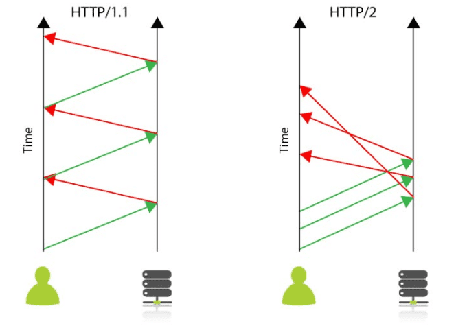
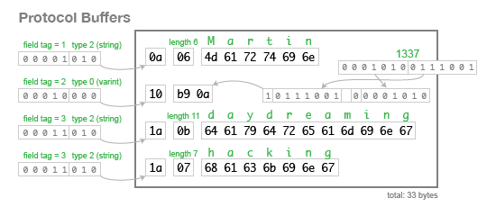

# gRPC - google Remote Procedure Call

## 1. gRPC의 등장배경
### 1-1. Server-Client
1. PC의 개념이 없던 시절 프로그램은 하나의 메인 프레임에서 동작하는 Monolothic구조로 설계되었다.
2. 기술 발전에 따라 PC와 같은 소형 컴퓨터 장비들이 등장함.
3. 기업 입장에서 고가인 메인 프레임워크를 비교적 저렴한 저가의 워크스테이션 서버로 대체하고 싶지만, 메인 프레임워크의 초고사양 서비스를 워크스테이션 서버에서 그대로 제공하기엔 한계가 있다.
4. 때문에, 메인 프레임워크의 기능을 워크스테이션 서버로 분산시키고, 네트워크 연결로 서비스하는 방식(Server-Client Model)을 채택하게 된다.

이처럼 서버와 개인 PC 간 통신이 중요해 지며, OSI 7 layer, TCP/IP 등 네트워크 계층 구조가 정의되고 발전되기 시작한다.

### 1-2. IPC - Inter Process Comunication
프로세스는 기본적으로 상호 독립적이지만, 필요에 따라 프로세스간 정보를 교환해야 하는 경우가 생긴다. 이 때 별도 수단을 활용하여 **프로세스 간 통신 방법론을 통칭하여 `IPC - Inter Process Comunication`** 라고 한다.
- `socket`, `message queue`, `pipe`, `rpc`, `rest`등이 있다.

#### 1. Socket
socket이란, OSI 7 layer 구조의 Application Layer(L7)에서 Transport Port(L4)의 TCP 또는 UDP를 이용하기 위한 수단이다.

socket은 대부분 언어에서 API로 제공되어 편리하지만 다음과 같은 단점이 있다.
- 일련의 통신 과정을 직접 구현하므로 통신 관련 장애를 개발자가 직접 처리해야 한다.
- 서비스가 고도화될 수록 수 많은 데이터가 돌아다니게 될텐데, 이에 따라 data formatting 을 하는 것도 점점 어려워지게 된다.


이런 소켓의 한계에서 RPC가 등장하게 되었다.
#### 2. [RPC - Remote Procedure Call](rpc.md)
이름 그대로 네트워크로 연결된 서버 상의 프로시저(함수, 메서드 등)를 원격으로 호출할 수 있는 기능이다.
- 통신이나 call방식에 신경쓰지 않고 원격지의 자원을 사용할 수 있다.
- `IDL - Interface Definication Language`기반으로 다양한 언어를 가진 환경에서 쉽게 확장할 수 있다.


RPC는 상당히 획기적인 방법론이었으며, 분산 환경의 등장에 따라 함께 발전해 온 오래된 기술이며 여러 구현체 CORBA, RMI 등이 있었지만...  
이들 모두
- 구현의 어려움
- 지원 기능의 한계

등으로 제대로 활용되지 못하고 REST가 우위를 점하게 된다.

#### 3. REST
REST는 HTTP/1.1 기반으로 URI를 통해 모든 Resource을 명시하고 HTTP Method를 통해 처리하는 아키텍쳐이다.

- HTTP를 계승하여 별도 작업 없이 쉽게 사용할 수 있다.

하지만... 
- REST는 표준이 아닌 방법론이기 때문에 parameter와 응답 값이 명시적이지 않다.
- HTTP 메소드의 형태가 제한적이기 때문에 세부 기능 구현에는 제약이 있다.
  > ex. 로그인을 POST로 구현함
- data format으로 xml, json을 많이 사용하는데...
  - xml은 복잡하고 비효율적인 구조로 속도가 느리고,
  - json은 제공 데이터의 한계로 파싱 후 추가 형변환이 필요하다.
  - xml, json모두 string 기반이라 사람이 읽기 편하지만 데이터 전송 및 처리를 위해선 별도의 Serialization이 필요하다.

## 2. gRPC의 개념과 특징
> Socket, REST의 한계를 극복하고 기존 RPC구현체들의 단점을 보완한 기술

gRPC는 google에서 개발한 오픈소스 [RPC](rpc.md) 프레임워크이다.

이전까지 RPC기능은 제공하지 않고 메세지(JSON 등)을 Serialize할 수 있는 프레임워크인 PB(Protocol Buffer, 프로토콜 버퍼)만을 제공해왔는데,  
**PB기반 Serizlaizer와 HTTP/2를 결합하여 RPC프레임워크를 탄생시켰다.**

### 특징
- HTTP/2를 사용한다.
- Protocol Buffer로 데이터를 전달한다.
  > Proto File만 배포하면 환경과 프로그램 언어에 구애받지 않고 서로 간 통신이 가능하다.

## 3. gRPC의 핵심 기술
### 3-1. HTTP/2

#### HTTP/1의 문제점
- HTTP/1은 기본적으로 요청이 올때만 서버가 응답을 하는 구조로 매 요청마다 connection을 생성해야 하고, 
- cookie등 많은 메타 데이터를 저장하는 header가 요청마다 중복 전달되어 느렸다.

#### HTTP/2의 장점
- HTTP/2에서는 **하나의 connetion으로 여러개의 메시지를 주고받으며**, 
- **header를 압축하여 중복 제거 후 전달**하기에 HTTP/1보다 효율적이다.
- 필요시 **클라이언트의 요청 없이 서버가 리소스를 전달할 수 있어** 클라이언트의 요청을 간소화할 수 있다.



### 3-2. Protocol Buffer
Protocol Buffer는 google사에서 개발한 구조화된 데이터를 `직렬화 - Serialization`하는 기법이다.

아래 예제처럼 같은 정보를 저장해도 
- text기반인 json의 경우 82byte가 소요되지만,  
- 직렬화된 protocol buffer는
  1. 필드 번호, 필드 유형 등을 1byte로 받아 식별하고,  
  2. 주어진 length만큼 읽도록 하여 단지 33byte만 필요하게 된다.

#### json
```json
{
    "userName": "Martin",
    "favouriteNumber": 1337,
    "interests": ["daydreaming", "hacking"]
}
```
#### protocal buffer
```proto
message Person {
    required string user_name        = 1;
    optional int64  favourite_number = 2;
    repeated string interests        = 3;
}
```


### 3-3. Proto File
Protocol Buffer 에서 사용하는 데이터 타입에 대한 정의 같은 Protocol Buffer 의 기본 정보를 명세한다.
> 공식문서: https://developers.google.com/protocol-buffers/docs/proto3

#### 1. Message & Field
Proto File에서는 주고 받는 data들을 message 라는 것으로 정의한다.

```proto
syntax = "proto3"

message SearchRequest {
    string query_1 = 1;
    string query_2 = 2;
    int32 page_number = 3;
    int32 result_per_page = 4;
}
```

- **Naming**
  - message 이름은 CamelCase 권장
  - field 이름은 snake_case 권장
  - 숫자 표기시 문자 뒤에 표기
- **Field Tag (= Field number)**  
  : 메시지에 정의된 필드들은 각각 고유한 번호를 가지게되고 이는 Enconding 이후 binary data에서 필드를 식별하는데 사용된다.
  - Field Tag는 최소 1, 최대 536,870,911(=229–1) 로 지정 가능하다.
  - 19000 ~ 19999는 프로토콜 버퍼 구현을 위해 reserved 된 값이므로 사용할 수 없다.
- **proto2 VS proto3**  
  `syntax = “proto3”`을 지정해줌으로써 proto version 3의 규약을 따르겠다고 선언했다. 이를 명시하지 않으면 default로 version2 문법을 따른다.
  - proto2 지원 언어 : C++, Java, Python, Go 등...
  - proto3 지원 언어 : C++, Java, Python, Go, Ruby, Objectice-C, C#, JavaScript, PHP, Dart 등...
- **Proto File Field Rule**
  - required : 필수로 가져야 할 필드 (only use proto2)
  - optional : 해당 필드를 가지지 않거나 하나만 가짐 (only use proto2)
  - repeated : 임의 반복 가능한 필드 (번호 및 값의 순서는 보존)
  - *[packed=true] 옵션 : key-value 쌍 형태에서 value만 반복

proto2 의 경우 required 와 optional 을 필드별로 무조건 명시해야한다.

#### 2. Package
package는 message type 이름을 중첩없이 구분할 때 사용한다.

package 미사용 예제
```proto
message Open{
    //...
}

message Foo{
    Open open = 1;
}
```

package 사용 예제
```proto
package foo.bar
message Open{
    //...
}

message Foo{
    Open open = 1;
}
```  

#### 3. Service
Service는 RPC를 통해 서버가 클라이언트에게 제공할 함수의 형태를 정의한다. 
- 서비스명과 RPC 메소드명 모두 CamelCase 형태를 권장한다.
- stream옵션을 주지 않으면 request-response로 동작하지만, stream 옵션을 주면 RPC를 구현할 수 있다.

**Unary RPC 예시**
```proto
service SearchService {
   rpc Search (SearchService) returns (SearchResponse);
}
```

**양방향 Streaming RPC 예시**
```proto
service SearchService {
    rpc Search (stream SearchRequest) returns (stream SearchResponse)
}
```


## Reference
- https://medium.com/naver-cloud-platform/nbp-기술-경험-시대의-흐름-grpc-깊게-파고들기-1-39e97cb3460
- https://martin.kleppmann.com/2012/12/05/schema-evolution-in-avro-protocol-buffers-thrift.html