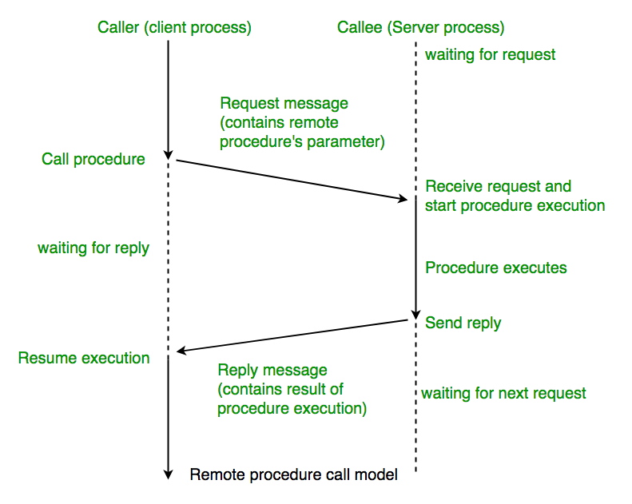
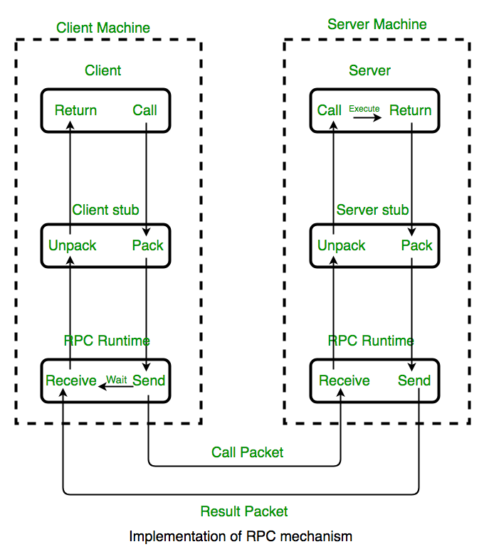

# RPC - Remote Procedure Call

## 1.  등장 배경 - MSA(Micro Service Architectrue)
https://en.wikipedia.org/wiki/Remote_procedure_call#History_and_origins

## 2. RPC의 개념
RPC란 프로세스간 통신을 위해 사용하는 [`IPC - Inter Process Communication`](/cs/ipc.md) 방법의 한 종류이며, 
**원격지의 프로세스에 접근하여 프로시저 또는 함수를 호출하여 사용한다.**
> 즉, 원격지의 프로시저를 호출하는 것이다.

- RPC는 `분산 컴퓨팅`, `client-server`를 베이스로 한 앱을 위한 기술이다.
- RPC는 일반적인 로컬 프로시저 호출을 확장하는 것을 기반으로 한다.
- 두 프로세스들이 같은 시스템에 있거나 다른 시스템에 존재하며 네트워크가 프로세스들을 연결하는 형태로 존재한다.

> #### IPC란? 
> Socket, Shared Memory, Message Queue와 같이 프로세스틀이 통신하는 모든 형태를 일컷는다.

> #### 프로시저의 목적
> 결과 값에 집중하기 보다 **명령 단위가 수행하는 절차를 목적**으로 한다,

> #### 함수의 목적
> 함수는 **Input에 대비한 Output의 발생을 목적**으로 한다.

### 2-1. RPC의 궁극적인 목표
- client-server간 커뮤니케이션에 필요한 상세한 정보는 최대한 감춘다.
- 클라이언트는 `일반 메소드를 호출하는 것` 처럼 원격지에 프로시저를 호출할 수 있다.

## 3. RPC의 동작 방식

1. `client`는 일반적인 방법으로 매개변수를 전달하여 **`client stub procedure`를 호출한다.**
   > `client stub`은 클라이언트속 주소 공간에 있다.
2. **`client stub`은 매개변수를 메시지로 마샬링(pack)** 한다. 
   > 마샬링에는 매개변수 표현을 표준 형식으로 변환하고 각 매개변수에 메시지를 복사하는 작업이 포함된다.
3. `client stub`은 메시지를 원격`Server Machine`으로 보내는 전송 계층으로 전달한다.
4. 서버의 `transport layer`은 매개변수를 `디마셜링 - demarshalling`(unpack)하고 일반 프로시저 호출 메커니즘을 사용하여 원하는 서버 루틴을 호출하는 `server stub`에 메시지를 전달한다.  
5. 서버 프로시저가 완료되면 `server stub`으로 반환되며, 반환값을 메시지로 마샬링후 `server stub`은 메시지를 `transport layer`에 전달한다.
6. `transport layer`는 결과 메시지를 client `transport layer`으로 다시 보내고, `client`의 `transport layer`는 메시지를 `client stub`으로 다시 전달한다.
7. `client stub`은 반환 매개변수를 디마샬링하고, 실행 결과값은 호출자(caller)에게 반환된다.

### 3-1. 용어 설명
#### stub
- client stub : 마샬링(함수호출에서 사용되는 파라미터의 변환)과 함수 실행 후 서버에서 전달된 결과의 변환을 담당한다.
- server stub : 언마샬링(클라이언트가 전달한 매개변수의 역변환) 및 함수 실행 결과의 변환을 담당한다.

#### caller / callee
- client / server가 필요한 비즈니스 로직을 작성하는 Layer
- `IDL - interface definition language`로 작성

#### RPC RunTime
- Server와 Client를 바인딩하는 Layer
- 커뮤니케이션 중 발생한 에러 처리도 함께 진행한다.

#### 루틴
루틴과 서브 루틴은 어떤 프로그램이 실행될 때 불려지거나 반복해서 사용되도록 만들어진 일련의 코드들을 지칭하는 용어이다.

## 4. RPC의 장단점
### 4-1. 장점
- 추상화를 제공한다.
  > 네트워크 통신의 메시지 전달 특성은 사용자에게 숨겨져 있다.
- 성능향상을 위해 많은 프로토콜 계층을 생략할 수 있다.
- RCP를 사용하면 **로컬환경뿐만 아니라 분산환경에서도 응용 프로그램을 사용할 수 있다.**
- `프로세스 지향`/`쓰레드 지향`모델을 지원한다.
- 클라이언트가 high-level 언어로 프로시저 호출을 사용하여 서버와 통신할 수 있도록 돕는다.

### 4-2. 단점
- 통일된 표준이 없다.
  > 그래서 여러 벤더가 존재한다.
- 상호작용 기반이므로 하드웨터 아키텍처와 관련하여 유연성을 제공하지 않는다.
- 항상 많은 양의 데이터를 전송하는데 적합하지 않다.
  > 클라이언트와 서버는 다른 실행환경을 사용할 수 있기 때문이다.

## 5. RPC의 대표적인 벤더
- [ProtocolBuffer by Google](https://developers.google.com/protocol-buffers/)
- [Thrift by Facebook](https://thrift.apache.org/)
- [Finalge by Twitter](https://twitter.github.io/finagle/)

## Reference
- https://www.geeksforgeeks.org/remote-procedure-call-rpc-in-operating-system/
- https://velog.io/@jakeseo_me/RPC%EB%9E%80
- https://nesoy.github.io/articles/2019-07/RPC
- https://velog.io/@xylopeofficial/gRPC1
- https://www.techtarget.com/searchapparchitecture/definition/Remote-Procedure-Call-RPC
- http://www.terms.co.kr/routine.htm