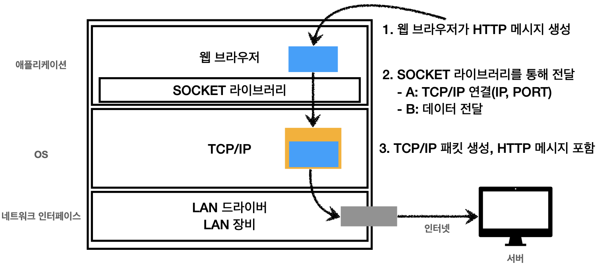

# 웹 브라우저의 요청 흐름

1. 웹 브라우저가 HTTP 메시지를 생성한다.
2. SOCKET 라이브러리에서 OS의 TCP/IP계층에 데이터를 전달한다.
   1. 통신할 서버의 IP와 PORT를 통해 TCP/IP를 연결한다.
    > 3 way handshake
   2. OS의 TCP/IP계층에 데이터를 전달한다.
3. HTTP메시지를 포함한 TCP/IP 패킷을 생성한다.