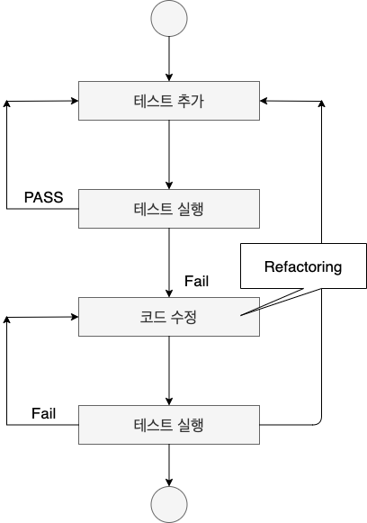

# TDD, BDD
## TDD - Test Driven Development
: 테스트 코드를 작성하고 테스트로 검증된 코드를 가지고 실제 코드를 작성하는 애자일의 대표적인 개발 방법론
- **매우 짧은 개발 서클의 반복**을 갖는 소프트웨어 개발 프로세스이다.
- 새로운 기능에 대한 자동화된 테스트케이스를 작성하고 해당 케이스를 통과하면,  
  가장 짧고 가독성이 좋고 유지보수성이 뛰어난 코드를 작성할 확률이 높다.
- 일단 테스트를 통과하는 코드를 작성하고 상황에 맞게 리팩토링한다.
- **거의 모든함수**를 테스트해야한다.

### 진행과정


### 장점
- 리팩토링 속도 향상, 재설계의 시간 단축 
  >끊임없이 test를 하므로 에러가 생길 가능성 사라짐
- 테스트에 대한 문서작성의 필요가 없어진다.
  > 테스트를 통과해야지 코드가 추가되므로

### 단점
- 코드 생산성의 문재
- 테스트 코드 작성 난이도 문제

## BDD - Behavior Driven Development
: 자연스럽고 읽기 쉬운 일종의 **유비쿼터스 언어**로써 테스트를 작성하는 방법
- TDD에서 파생되었다.
- 프로그램에 기대되는 "요구스펙"에 가까운 형태로 자연어를 병기하며 테스트 코드를 작성한다.  
    -> 즉, 비지니스 로직에 따른 시나리오 기반으로 테스트 코드를 작성한다.
- 테스트 프레임워크의 메소드 이름도 자연어에 가까운 형태를 취한다.  
  -> 사용자 위주로 작성
- **Given, When, Then 구조를 가지는 것을 기본 패턴**

### BDD 기본 테스트 구조
- **Feature** - 테스트에 대상의 기능/책임을 명시한다.
- **Scenario** - 테스트 목적에 대한 상황을 설명한다.
- **Given** - 시나리오 진행에 필요한 값을 설정한다.
- **When** - 시나리오를 진행하는데 필요한 조건을 명시한다.
- **Then** - 시나리오를 완료했을 때 보장해야 하는 결과를 명시한다.

### BDD의 Given-When-Then 스타일
1. 특정 상황(값)이 주어지고(Given)
2. 어떤 이벤트가 발생했을 때(When)
3. 그에 대한 결과를 보장해야 한다(Then)
> Given I am on the home page  
> When I enter my username "siwony_"  
> And I enter my password "siwony_pw"  
> Then I should see my username "siwony_" on the dashboard


### SpringBoot BDD
Spring Boot 에서는 BDDMockito를 사용하여 BDD를 할 수 있다.
```java
import static org.mockito.BDDMockito.*;

Seller seller = mock();
Shop shop = new Shop(seller);

@Test
public void shouldBuyBread() throws Exception {
  //given  
  given(seller.askForBread()).willReturn(new Bread());

  //when
  Goods goods = shop.buyBread();

  //then
  assertThat(goods, containBread());
}

```
reference : https://dongdd.tistory.com/165