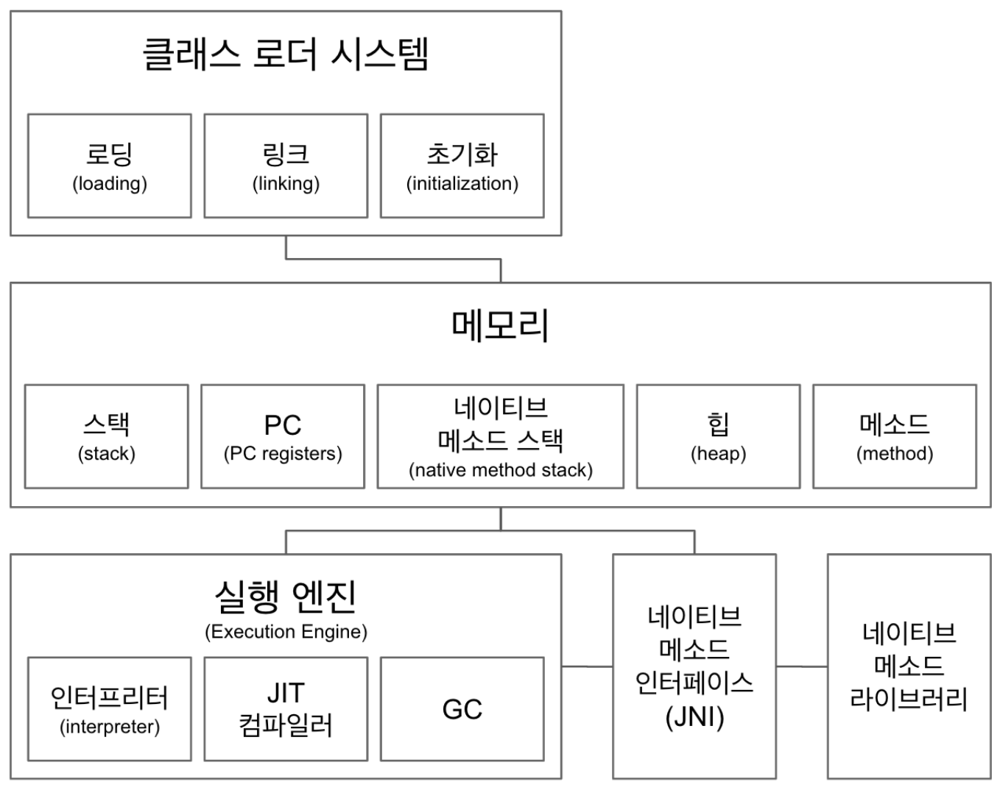

# JVM 구조

### 클래스 로더 시스템 - Class Loader
> 로딩 &rarr; 링크 &rarr; 초기화
- `.class`파일 에서 bytecode를 읽고 메모리에 저장한다.
- 로딩: 클래스를 읽어오는 과정
- 링크: 레퍼런스를 연결하는 과정
- 초기화: static 값을 초기화 및 변수에 할당

### 메모리 - Memory
- **메서드 영역 - method**  
  : 클래스 수준의 정보(이름, 부모 클래스 이름, 메소드, 변수)저장하고, 해당 자원은 모든 영역에 공유된다.

- **힙 영역 - heap**  
  : 객체를 저장하고, 해당 자원은 모든 영역에 공유된다.

- **스텍 영역 - stack**  
  - Thread마다 런타임 stack을 만들고 스텍프레임을 블럭으로 쌓는다.
  - Thread가 종료되면 런타임 스택도 사라진다.
  > **스텍프레임**  
  > : 스택 영역에 저장되는 메소드의 호출 정보를 의미한다.  
  > 메서드 하나당 하나의 스택 프레임이 존재한다.

- **PC - Program Counter**  
  : 스레드 속 현재 실행할 스택 프레임을 가리키는 포인터가 생성한다.
  - thread를 호출할 때 생긴다.

- **네이티브 메서드 스택 - Native Method Stack**  
  : native method를 호출할 때 사용한다.
  - thread를 호출할 때 생긴다.

//todo 여기 보고 좀 더 정리 https://javapapers.com/core-java/java-jvm-run-time-data-areas/#Program_Counter_PC_

### 실행 엔진 - Execute Engin
- **인터프리터 - Interpreter**  
  byte code를 한줄 씩 실행한다.

- **JIT 컴파일러 - Just In Time Compiler**  
  인터프리터가 반복되는 코드를 발견하면 JIT 컴파일러로 반복되는 코드를 모두 네이티브 코드로 바꿔둔다.   
  &rarr; 인터프리터는 네이티브 코드로 컴파일된 코드를 바로 사용한다

- **GC(Garbage Collector)**  
  더 이상 참조되지 않는 객체를 모아서 정리한다.

### JNI - Java Native Interface
Java application에서 C, C++, 어셈블리 같은 언어로 작성된 함수를 사용할 수 있는 방법을 제공한다.
- Native 키워드를 사용한 메소드 호출할 수 있다.
