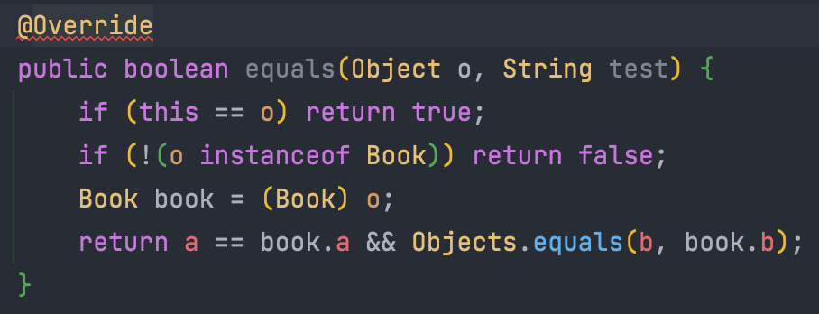

# Annotation
Annotation은 그자체로 주석이라는 의미를 가진다. 하지만 일반 주석이랑 다르다!
- JDK5 버전부터 사용할 수 있다.
- `@`를 붙여서 사용한다.
- Reflection을 이용해 Class의 Annotation을 조회할 수 있다.
- Annotatino은 interface에 해당된다.


### Annotation의 용도
> 대부분 사용되는 용도는 다음과 같다.
#### 1. 컴파일러에게 코드 작성 문법 에러를 체크하도록 정보를 제공
대표적으로 Java에서 제공하는 `@Override`가 있다.

다음은 equals를 Override하는 예시이다.
```java
@Override
public boolean equals(Object o) {
    if (this == o) return true;
    if (!(o instanceof Book)) return false;
    Book book = (Book) o;
    return a == book.a && Objects.equals(b, book.b);
}
```
다음과 같이 파라미터가 다르면 `@Override`에서 에러가 발생하는 것을 볼 수 있다


에러 메시지
```sh
파일경로/Book.java:10:5
java: method does not override or implement a method from a supertype
```

#### 2. 소프트웨어 개발툴이 빌드나 배치시 코드를 자동으로 생성할 수 있도록 정보 제공
대표적인 예시로 Querydsl의 Q타입 Entity를 생성하는 것이 있다. 이를 가능하게 하는 기능을 annotation processor라고 한다.

#### 3. 실행시(런타임시)특정 기능을 실행하도록 정보를 제공
annotation은 클래스, 메서드, 필드등에 대한 메타데이터를 가질 수 있다. 대표적인 예로 SpringBoot의 `@Component`가 있는데 이 annotation이 붙여진 class는 Spring의 관리대상에 포함된다.

.  
.  
. ETC...

### Use Case
- 컴파일러를 위한 정보제공 :  `@FunctionalInterface` ,` @supresswarnings`
- 자동 문서 작성 : Jenkins, Jira, Teamcity 등...
- 코드 자동 생성 : Querydsl, lombok, JAXB 등...
  > annotation processor
- 런타임 프로세싱 : Junit, DI(Spring), logging(Log4J), DA(Hibernate) 등...


## Annotation의 구성
다음은 Annotation의 예시이다.
```java
@Target({ElementType.FIELD})
@Retention(RetentionPolicy.RUNTIME)
public @interface Annotation {
}
```
### @Target(ElementType[])
: Annotation이 적용할 위치를 나타낸다.
|위치|Element Type|
|---|------------|
|패키지| `ElementType.PACKAGE`|
|클래스, 인터페이스, enum, record|`ElementType.TYPE`|
|Annotation 타입| `ElementType.ANNOTATION_TYPE`|
|생성자|`ElementType.CONSTRUCTOR`|
|맴버 변수|`ElementType.FIELD`|
|지역 변수|`ElementType.LOCAL_VARIABLE`|
|메서드| `ElementType.METHOD`|
|Record component | `ElementType.RECORD_COMPONENT` |
|매개변수|`ElementType.PARAMETER`|
|파라미터 타입|`ElementType.TYPE_PARAMETER`|
|타입|`ElementType.TYPE_USE`|

### `@Retention(RetentionPolicy)`
: Annotation 의 Scope를 제한한다.
- **`SOURCE`**  
  어노테이션 정보가 컴파일시 사라진다. 즉, 바이트코드에 존재하지 않는다.
  > ex. `@Override`, `@SuppressWarnings`, lombok의 `getter/setter`
- **`CLASS`**
  클래스 파일에 존재하고 컴파일러에 의해 사용가능, 가상머신(런타임)에서는 사라진다.
- **`RUNTIME`**
  실행시 어노테이션 정보가 가상 머신에 의해서 참조 가능. reflection에 의해 사용될 수 있다.

#### CLASS는 왜 사용될까?
> 참고: https://stackoverflow.com/questions/38975073/retention-of-java-type-checker-annotations

CLASS 정책은 Maven과 Gradle로 다운받은 라이브러리와  jar파일은 소스코드(`.java`)가 아닌 바이트코드(`.class`)만 남겨진다.  

`.class` 파일만 존재하는 라이브러리 같은 경우에도 타입체커, IDE 부가기능 등을 사용할수 있으려면 CLASS 정책이 필요하다.  
SOURCE 정책으로 사용한다면 컴파일된 라이브러리의 jar 파일에는 어노테이션 정보가 남아있지 않기 때문에 위와 같은 기능을 사용할 수 없다.  

### 추가적인 구성요소
#### `@Inherited`
슈퍼클래스를 상속한 서브 클래스에서도 해당 Annotation을 갖도록 한다.

```java
@Target({ElementType.TYPE})
@Retention(RetentionPolicy.RUNTIME)
public @interface Annotation {}

@Annotation
public class SuperClass{}

public class DownClass extends SuperClass{}
```
리플렉션을 이용해 DownClass의 Annotation가져오기
```java
public static void main(String[] args) {
    Class<DownClass> downClassClass = DownClass.class;
    Arrays.stream(downClassClass.getAnnotations()).forEach(System.out::println);
}
```
출력 결과 예시
```sh
@패키지_이름.Annotation()
```

#### `@Documented`
`@Documented` 어노테이션이 지정된 대상의 JavaDoc 에 이 어노테이션의 존재를 표기하도록 지정한다.

### 변수
annotation은 변수를 사용할 수 있다. 변수의 형식은 다음과 같다.
```java
[public] 타입 변수명();
[public] 타입 변수명() default 기본값;
```

- `final`과 `abstract`, `private` 를 사용할 수 없다.
- public은 기본적으로 생략이 된다.
- 기본값에 null이 들어갈 수 없다.
- 변수의 타입은 기본형 혹은 `java.lang.String`형만 올 수 있다.

만약 annotation의 변수명이 value면 annotation를 다음과 같이 사용할 수 있다.
```java
@Target({ElementType.TYPE})
@Retention(RetentionPolicy.RUNTIME)
public @interface Annotation {
    String value();

    String a() default "";
}

@Annotation("hello")
public class ExClass1 { }

@Annotation(value = "hello", a = "a")
public class ExClass2 { }
```
