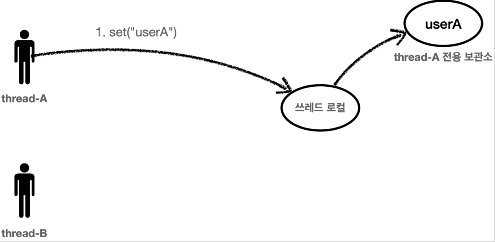
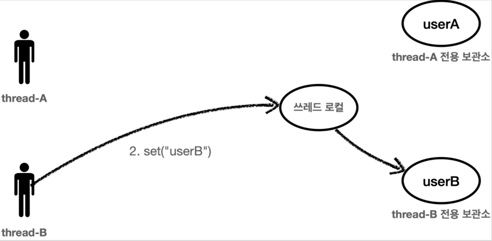
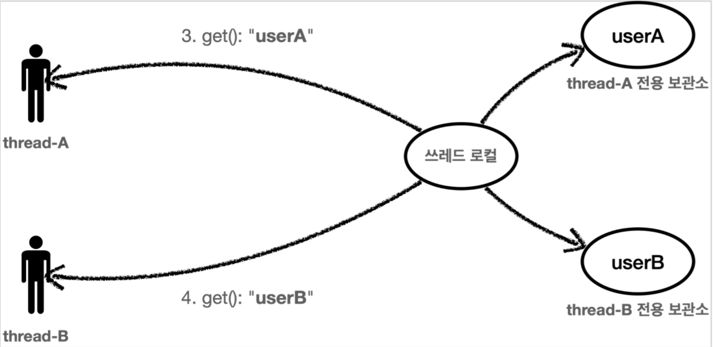
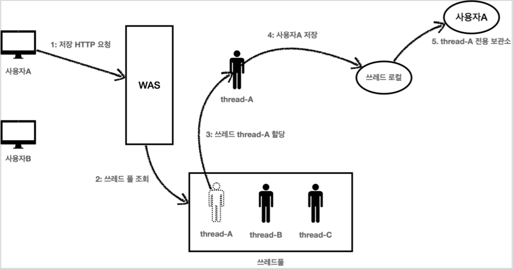
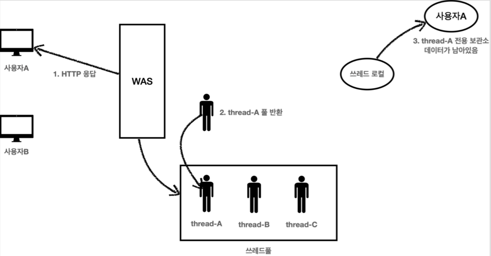

# 스레드 로컬 - Thread Local
### Reference
- [김영한 인프런 핵심 원리 - 고급편](https://www.inflearn.com/course/%EC%8A%A4%ED%94%84%EB%A7%81-%ED%95%B5%EC%8B%AC-%EC%9B%90%EB%A6%AC-%EA%B3%A0%EA%B8%89%ED%8E%B8)


## 스레드 로컬
: 스레드 단위로 로컬 변수를 할당하는 기능을 제공하는 클래스이다
- JDK1.2 부터 지원하고 java.lang패키지에 있다.

### Thread Local의 동작 원리
#### 값 저장
스레드 로컬를 사용하면 각 스레드마다 별도의 내부 저장소를 생성한다. 
> 같은 인스턴스 스레드 로컬 필드에 접근해도 동시성 이슈가 발생하지 않는다.


Thread-A             |  Thread-B
:-------------------------:|:-------------------------:
  |  

#### 값 조회
스레드 로컬을 통해 데이터를 조회해도 해당 Thread가 저장한 값을 알맞게 반환해준다.


## 사용 예시
#### ThreadLocal의 method
- `ThreadLocal.set()`: 스레드 로컬에 값 설정
- `ThreadLocal.get()`: 스레드 로컬에 값 얻기
- `ThreadLocal.remove()`: 스레드 로컬에 값 제거

### 예시
값을 저장하고 조회하는 간단한 서비스(`ThreadLocalService`)를 만들었다.
```java
@Slf4j
public class ThreadLocalService {

    private final ThreadLocal<String> nameStore = new ThreadLocal<>();

    public String logic(String name)  {
        log.info("저장 name={} -> nameStore={}", name, nameStore.get());
        nameStore.set(name);
        sleep(1000); // 대충 저장을 하면 1초가 걸림
        log.info("조회 nameStore={}", nameStore.get());
        return nameStore.get();
    }

    public void removeValueInThreadLocal(){
        this.nameStore.remove();
    }

    public String lockUpValue(){
        return nameStore.get();
    }

    private void sleep(long time){
        try {
            Thread.sleep(time);
        } catch (InterruptedException e) {
            e.printStackTrace();
        }
    }
}
```
- 일부로 동시성 이슈를 만들어 내려고 logic매서드 속에 해당 Thread를 1초동안 sleep하게 만들었다.
- 하지만 ThreadLocal를 통해 값을 nameStore값을 받으므로 동시성 이슈가 발생하지 않는다.

이제 태스트 코드로 확인해보자
```java
@Slf4j
public class FieldServiceTest {

    private ThreadLocalService service = new ThreadLocalService();

    @Test
    void field(){
        log.info("main start");
        Runnable userA = () -> {
            service.logic("userA");
            service.removeValueInThreadLocal();
            log.info("ThreadLocal 값 제거 후 조회 -> {}", service.lockUpValue());
        };

        Runnable userB = () -> {
            service.logic("userB");
            service.removeValueInThreadLocal();
            log.info("ThreadLocal 값 제거 후 조회 -> {}", service.lockUpValue());
        };

        Thread threadA = new Thread(userA);
        threadA.setName("thread-A");

        Thread threadB = new Thread(userB);
        threadB.setName("thread-B");

        threadA.start();
        threadB.start();

        sleep(3000); // Main Thread가 바로 종료되지 않도록한다.
        log.info("main exit");
    }

    private void sleep(long time) {
        try {
            Thread.sleep(time);
        } catch (InterruptedException e) {
            e.printStackTrace();
        }
    }
}
```
**출력 예시**
> 상황에 따라 스레드가 실행되는 시점이 다를 수 있다.
```sh
14:55:05.535 [main] INFO com.siwony.ifl_spring_advanced.trace.FieldServiceTest - main start
14:55:05.539 [thread-B] INFO com.siwony.ifl_spring_advanced.trace.thread_local.code.ThreadLocalService - 저장 name=userB -> nameStore=null
14:55:05.538 [thread-A] INFO com.siwony.ifl_spring_advanced.trace.thread_local.code.ThreadLocalService - 저장 name=userA -> nameStore=null
14:55:06.546 [thread-A] INFO com.siwony.ifl_spring_advanced.trace.thread_local.code.ThreadLocalService - 조회 nameStore=userA
14:55:06.546 [thread-B] INFO com.siwony.ifl_spring_advanced.trace.thread_local.code.ThreadLocalService - 조회 nameStore=userB
14:55:06.546 [thread-A] INFO com.siwony.ifl_spring_advanced.trace.thread_local.code.ThreadLocalService - 조회 nameStore=null
14:55:06.546 [thread-B] INFO com.siwony.ifl_spring_advanced.trace.thread_local.code.ThreadLocalService - 조회 nameStore=null
14:55:08.541 [main] INFO com.siwony.ifl_spring_advanced.trace.FieldServiceTest - main exit
```
- ThreadLocal를 사용해서 Thread가 ThreadLocalService의 똑같은 객체를 접근해 같은 ThreadLocal를 사용했지만 동시성 이슈가 발생하지 않았다.
- A-Thread는 A-Thread가 저장한 값인 userA를 제대로 저장 후 값을 가져왔다.
- B-Thread는 B-Thread가 저장한 값인 userB를 제대로 저장 후 값을 가져왔다.
- A-Thread, B-Thread는 `ThreadLocalService.remove`를 통해 `ThreadLocalService`속 ThreadLocal의 값을 remove해서 삭제 후 `lockUpValue()`매서드로 조회 했더니 null이 출력되었다.


### ThreadLocal의 주의사항
여기서 한 가지 의문이 드는 점이 있는데,  
"어차피 Thread가 종료되면 Thread에 따라 `ThreadLocal`도 제거될 텐데 왜 `ThreadLocal.remove()`를 통해 스레드 저장소의 저장된 값을 지우는 거지?"라는 의문이 들 수 있다.

하지만 이는 나중에 얘기치 못한 상황을 불러 올 수 있는데 특히 Thread Pool를 사용하는 Tomcat과 같은 시스템에서 문제가 발생할 수 있다.

사용자 A의 요청                |  사용자 A의 요청에 대한 응답
:-------------------------:|:-------------------------:
  |  
- 사용자A는 WAS에 요청하여 Thread-A를 사용해 사용자 A를 저장후 사용자A에게 HTTP응답을 했다.
- 사용자A는 요청이 끝나 사용자A가 요청한 로직을 처리한 Thread-A는 Thread Pool에 반환되었다.
- Thread-A가 파괴되지 않았으므로 Thread-A는 스레드 로컬에는 사용자A의 데이터가 남아있다.

여기서 사용자B가 사용자B 즉, 자신의 정보를 조회하는 로직을 요청했는데, 하필 Thread-A를 사용하면 어떻게 될까?


1. 사용자B는 조회를 위한 HTTP요청을 한다.
2. WAS는 스레드 풀에서 스레드를 하나 조회한다.
3. 근데 하필 thread-A 가 할당되었다.
4. Thread-A는 스레드 로컬에서 데이터를 조회한다.
5. 스레드 로컬은 thread-A 전용 보관소에 있는 사용자A 값을 반환한다.
6. 결과적으로 사용자A 값이 반환된다.
7. **사용자B는 사용자A의 정보를 조회하게 된다.**

이렇게 사용자B가 사용자A를 조회하는 치명적인 문제가 발생할 수 있다.

이러한 문제가 발생할 수 있으므로 **스레드 로컬의 값을 `ThreadLocal.remove()` 를 통해서 꼭 제거해야 한다.**