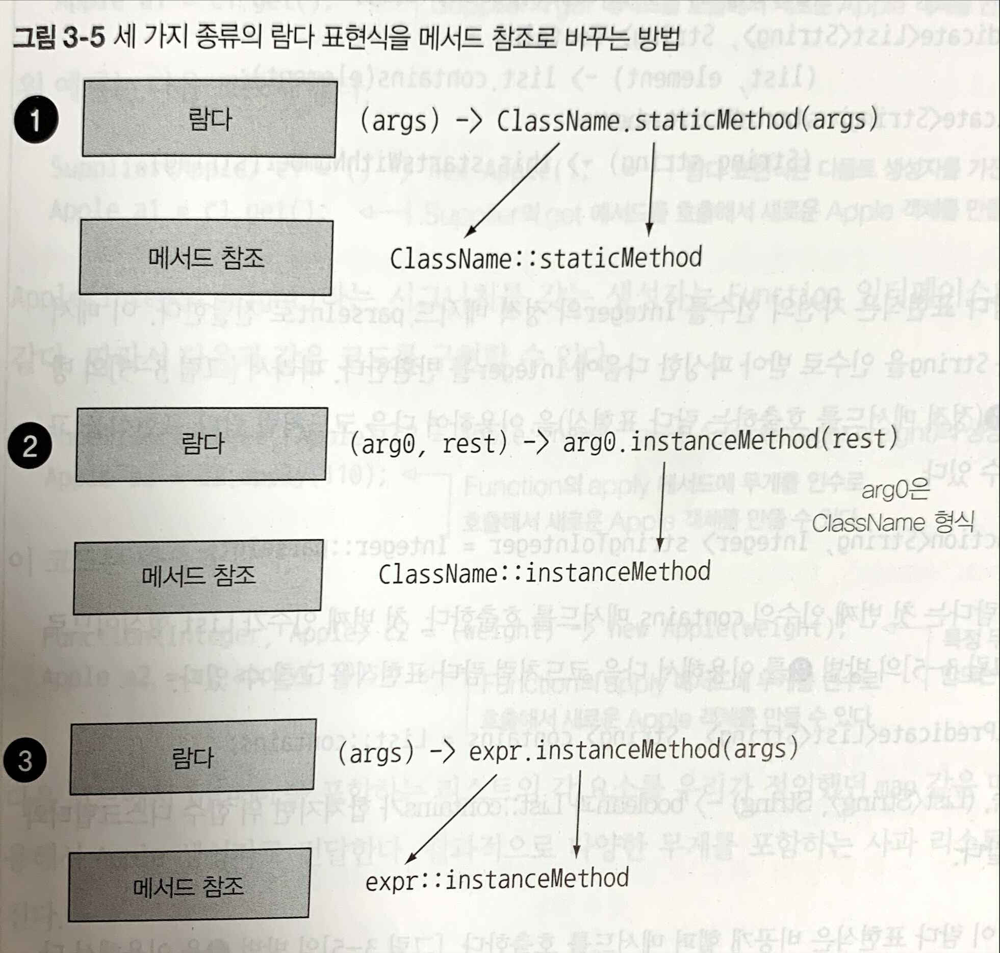

# 메소드 레퍼런스 - Method Reference
: Lambda 표현식을 더 간단하게 표현하는 방법입니다.
- 메소드 레퍼런스를 이해 하려면 Lambda를 먼저 이해해야 한다.
- **람다식이 구현되어있는 경우** 사용할 수 있는 **메서드 참조용 특수 문법**이다.

### Method Reference를 만드는 유형

> 참고자료 - 모던 자바 인 엑션 3장

#### 1. 정적 메서드 참조
: **파라미터로 전달받은 변수의 메서드를 사용하는게 아닌, 정적 메서드의 인자로 사용된다.**

예제
|                   Lambda                    |      Method Reference     | 
|---------------------------------------------|---------------------------|
|`(String x) -> Integer.parseInt(x)`          |`Integer::parseInt`        |
|`(SimpleMemberVO x) -> SimpleMemberVO.of(x) `|`SimpleMemberVO::of`       |

- `Integer`의 `parseInt` 메서드는 `Integer::parseInt`로 표현할 수 있다.
- `(String x) -> Integer.parseInt(x)`의 경우 파라미터 `x`를 `parseInt`의 인자로 사용된다.

#### 2. 다양한 형식의 인스턴스 메서드 참조
: 파라미터로 전달받은 변수의 메서드를 사용한다.
예시
|                       Lambda                     |       Method Reference       | 
|------------------------------------------------- |------------------------------|
|`(Instant x) -> x.toEpochMilli()`                 |`Instant::toEpochMilli`       |
|`(Optional<T> x) -> x.isPresent()`                |`Optional::isPresent`         |
|`(List<T> x) -> x.stream()`                       |`Collection::stream`          |
|`(String x, String y) -> x.compareTolgnoreCase(y)`|`String::compareToIgnoreCase` |
> T는 제네릭 타입 즉, 아무타입이나 올 수 있다.
- `String`의 `length`메서드를 `String::length`로 사용 가능
- `(Instant x) -> x.toEpochMilli()`의 경우 파라미터 `x`를 받아서 `x`자신의 메서드(`toEpochMilli()`)를 수행한다.
  
**`(String x, String y) -> x.compareToIgnoreCase(y)`를 표현한 `String::compareToIgnoreCase`는 무엇인가.**
1. 첫번째 파라미터가 메소드의 수신자가 된다.
2. 나머지 파라미터는 해당 메소드로 전달 된다.

#### 3. 기존 객체의 인스턴스 메서드 참조
: 기존에 이미 생성된 인스턴스의 인자로 사용 된다.
- 정적 메서드의 인자와는 다르다.

예시
|                   Lambda                    |      Method Reference      | 
|---------------------------------------------|----------------------------|
|`(Long x) -> memberRepository.findById(x)`   |`memberRepository::findById`|
|`(String x) -> member.updateUsername(x)`     |`member::updateUsername`    |

### 생성자 참조
- Method Reference와 비슷하다.
- `x -> new UserDto(x)`를 `UserDto::new`와 같은 형태로 사용할 수 있다.