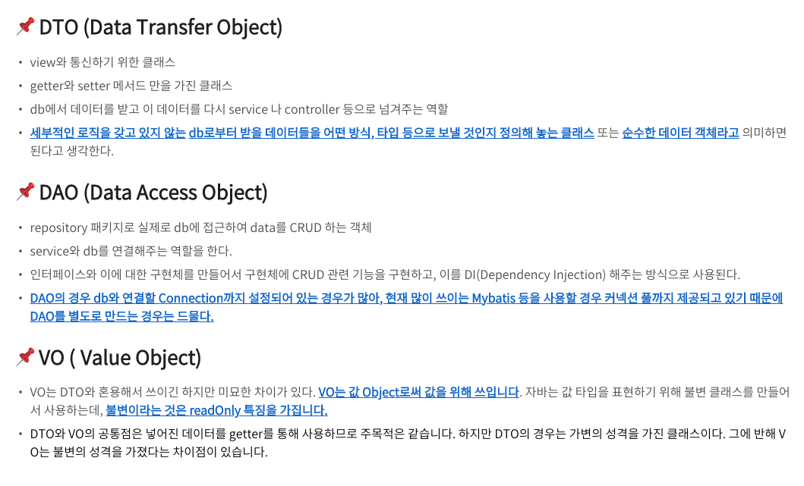
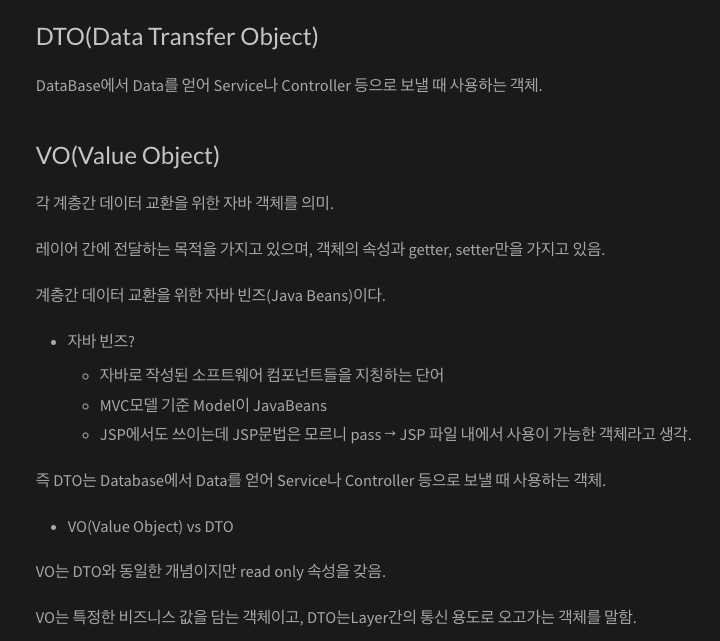
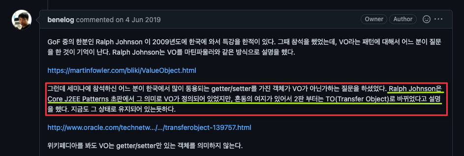
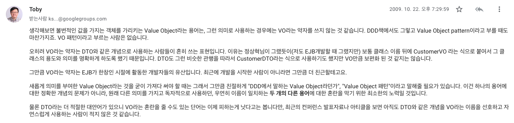

# VO 사실과 오해
> 2022.10.19(수) 사내에서 발표한 내용

*https://woogienote.tistory.com/m/88*


*https://kkminseok.github.io/posts/Spring_semina/*
 

위 2개의 사진에 나와있는 블로그는 VO는 객체의 속성과 getter, setter를 가지고 있다고하고, 다른 하나는 불변이라 readOnly의 특징을 가진다고 나와있습니다.

둘 다 계층간 데이터 교환을 위한 객체라고 설명하고 있습니다. 

근데 위 한국 블로그 2개랑 마틴 파울러의 VO가 다르네?!

## 마틴 파울러의 VO

Martin Fowler의 글에 의하면 

> I find it useful to think of two classes of object: value objects and reference objects, depending on how I tell them apart
>
> 나는 구별하는 방법에 따라 값 객체와 참조 객체,두 가지 클래스의 객체를 고려하는 것이 유용하다는 것을 알게되었다.

> When programming, I often find it’s useful to represent things as a compound.A 2D coordinate consists of an x value and y value.An amount of money consists of a number and a currency.A date range consists of start and end dates,which themselves can be compounds of year, month, and day.
>
>프로그래밍을 할 때, 사물을 복합물로 표현하는 것이 유용할 경우가 종종 있다.예를 들어, 2차원 좌표는 x, y로 이루어져 있고,돈이나 통화 같은 경우 숫자로 이루어져 있다.날짜의 범위는 시작 날짜와 종료날짜로 구성될 수 있고,연도와 월, 일의 복합물일 수 도 있다.

예시. Point(x = 1, y = 2), Date(month = 1, day = 4) 

즉 VO란, 한개 이상의 속성들을 묶어 특정 값을 나타내는 객체를 말하고, 

VO는 도메인 객체의 일종이며, 보통 기본키로 식별 값을 갖는 Entity와 구별해서 사용된다.

## 마틴 파울러의 VO를 다음과 같이 구분해서 설명하고 있다.

1. equals & hash code 메서드 재정의

기본적으로 객체를 === 비교(동일성)비교를 하면 객체의 참조 주소를 비교하고 == (동등성)비교를 하면 객체의 값(프로퍼티)를 기반으로 비교를 하게 된다.

RGB(0,0,0) == RGB(0,0,0) // false? 하얀색과 하얀색이 다르다?

equals & hash code 메서드를 재정의 한다면 속성값이 같은 객체를 보장할 수 있다.

2. 수정자(Setter)가 없는 불변(Immutable) 객체

Entity와 같은 경우 별도의 식별 값을 가지고 있기 때문에내부 속성 값이 변경된다고 하더라도 같은 객체로 계속 인식하고 추적할 수 있습니다.  
하지만 속성 값 자체가 식별 값인 VO는 속성 값이 바뀌게 되면 식별 값도 바뀌게 되어 추적이 불가능하고,복사 될 때는 의도치 않은 객체들이 함께 변경되는 문제를 유발합니다.

따라서 VO는 값을 변경할 수 없는 불변 객체로 만들어야합니다.

```kotlin
class RGB(var r : Int, var g : Int, var b : Int){
  overried fun toString() : String
}

val color = RGB(0,0,0)
val blackFont = FontStyle(color)

color.r = 180
color.g = 85
color.b = 162

val purpleFont = FontStyle(color)

print(blackFont.color) // Color(180, 85, 162) 출력
print(purpleFont.color) // Color(180, 85, 162) 출력
```

근데 왜 데이터 이동을 위한 객체도 VO라고 부르는걸까?

이는 해당 글의 Further Reading 부분에서 확인할 수 있다.

> One source of terminological confusion is that around the turn of the century some J2EE literature used "value object" for Data Transfer Object. That usage has mostly disappeared by now, but you might run into it.
>
> 용어 혼란의 한 가지 원인은 세기가 바뀔 무렵 일부 J2EE 문헌에서 Data Transfer Object 에 "Value Object"를 사용했다는 것 입니다. 그 사용법은 지금은 대부분 사라졌지만, 아마 이것을 우연히 만날 수 있다.

즉 J2EE문헌에서 데이터 전달에 사용하는 객체를 VO라고 했었던 것이다.

## J2EE에서의 VO


Core J2EE Patterns에서 VO는 데이터를 전송하기 위한 객체에 대한 패턴을 의미한다.

내부적으로 Java Beans spec을 따라야 한다.

자바빈즈 JavaBeans 클래스 규약

1. private 접근제한자로 필드를 선언한다. (필수)

2. getter 메소드와 setter 메소드를 갖는다. (필수)

3. 기본 생성자가 반드시 존재해야 된다. (필수)

4. implements Serializable (선택)

하지만 이는 혼동의 여지가 있어 Core J2EE Patterns 2판에서 VO를 TO(Transfer Object)라고 변경했다.

TO에 대해 자세히 알고싶다면 oracle 참조. https://www.oracle.com/java/technologies/transfer-object.html 



## 그럼 VO는 어떻게 써야할까?

VO 정확히 말하면 VO Pattern에서의 VO객체는 TO(Transfer Object)로 변경되었다.

데이터 전달을 위한 VO를 사용하고 싶다면 확실하게 Value Object 패턴 이라고 말해줄 필요가 있다.

하지만 J2EE pattern에 나와있듯이 VO는 오해에 소지가 있어 TO로 변경되었으니 TO를 사용하는게 좋지 않을까?

마지막으로 KSUG에서의 Toby님의 대화를 첨부한다.


## 결론

내가 생각하기에 저 2개의 블로그가 VO를 다르게 설명하게 된 원인은 VO Pattern과 DDD에서의 Value Object를 구분하지 못하여 생기는 문제가 아닐까 라고 생각이 든다.

만약 VO Pattern에 대해 말하고 싶다면 Pattern을 명확하게 알려줘야 하고 애초에 VO를 J2EE core patterns에서는 TO라고 부르고 있다.

데이터 전달을 위한 객체는 VO보다 DTO로 부르는게 더 적절하므로 DTO를 사용하자

## References
- https://github.com/benelog/blog/issues/27
- https://groups.google.com/g/ksug/c/M3l6ZqKpaQ4/m/4rcCbgS_CXUJ
- https://martinfowler.com/bliki/ValueObject.html
- https://d2.naver.com/news/3435170
