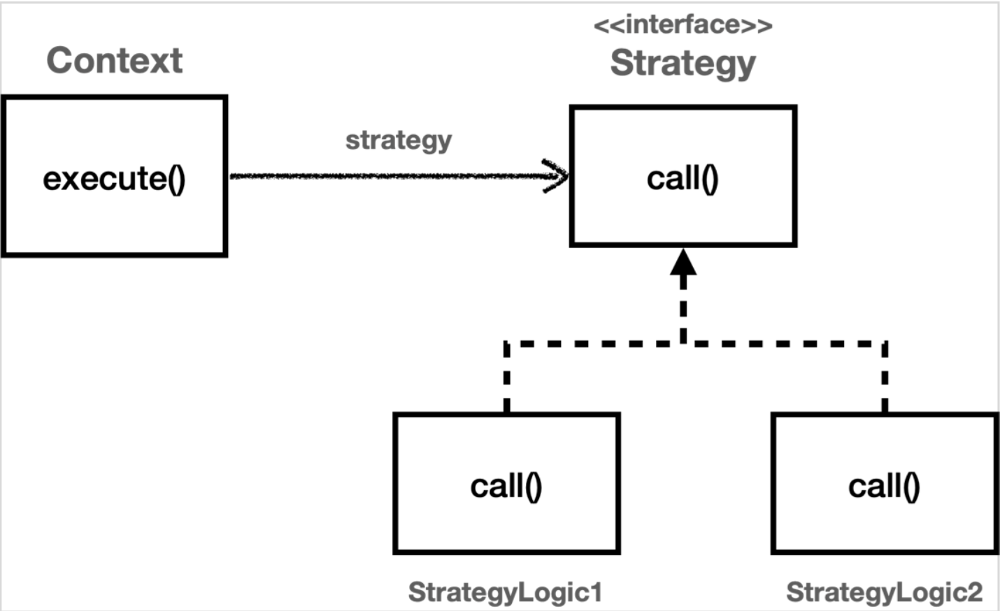
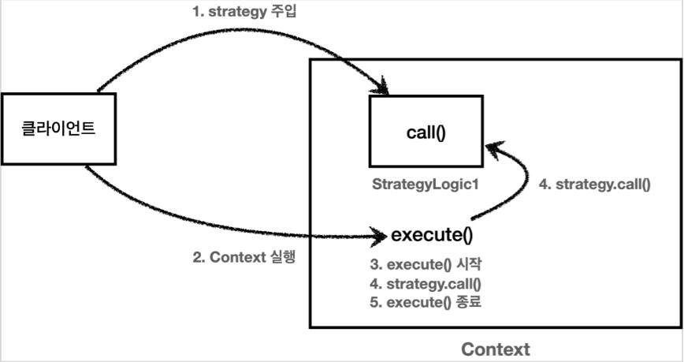
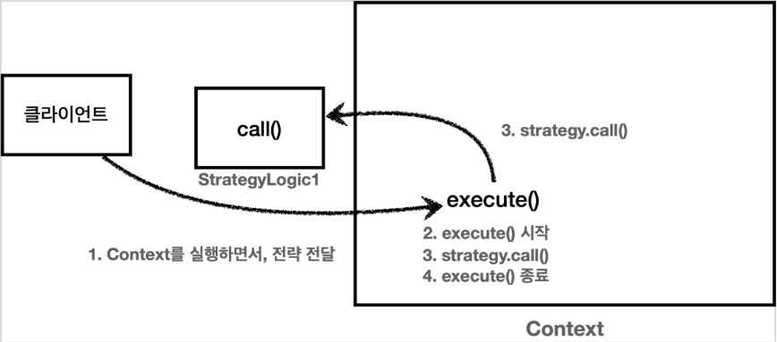

# Strategy Pattern(전략 패턴)
이전글: [템플릿 메서드 패턴](template-method-pattern.md)

#### 참고자료
- [김영한 인프런 핵심 원리 - 고급편](https://www.inflearn.com/course/%EC%8A%A4%ED%94%84%EB%A7%81-%ED%95%B5%EC%8B%AC-%EC%9B%90%EB%A6%AC-%EA%B3%A0%EA%B8%89%ED%8E%B8)
- [예제 코드](https://github.com/siwony/spring-core-principle-advanced/tree/main/src/test/java/com/siwony/ifl_spring_advanced/trace/strategy)

<p align=center></p>

전략 패턴은 **변하지 않는 부분을 `Context`** 라는 곳에 두고, **변하는 부분을 `Strategy`** 라는 인터페이스를 만들어 해당 인터페이스를 구현하도록 한다.

> 템플릿 메서드 패턴은 상속을 활용해 특정 부분만 변경하도록 한다. 전략패턴은 **위임**을 통해 특정 부분만 변경할 수 있다.

GOF의 디자인 패턴에서는 전략 패턴의 의도는 다음과 같다.
> 알고리즘 제품군을 정의하고 각각을 캡슐화하여 상호 교환 가능하게 만들자.   
> 전략을 사용하면 알고리즘을 사용하는 클라이언트와 독립적으로 알고리즘을 변경할 수 있다.

## 예제 - 비즈니스 로직의 수행 속도를 측정하여 로깅하기
> 실습환경: SpringBoot + lombok + junit5
### V1 - 필드에 전략을 저장하는 방식
> 객체의 생성과 동시에 Strategy 조립하기 - 선 조립, 후 실행
```java
@Slf4j
@AllArgsConstructor
public class ContextV1 {

    private Strategy strategy;

    public void execute(){
        long startTime = System.currentTimeMillis();
        // 비즈니스 로직 실행
        strategy.call();
        // 비즈니스 로직 종료
        long endTime = System.currentTimeMillis();
        long resultTime = endTime - startTime;
        log.info("resultTime={}", resultTime);
    }
}

public interface Strategy {
    void call();
}
```
- `ContextV1`은 변하지 않는 로직을 가지고 있는 템플릿 역할을 하는 코드이다.
  > 이것을 `컨텍스트 - context`라고 한다.
- `Context`는 내부에 `Strategy strategy`필드를 가지고 있다. 이 필드에 변하는 부분인 `Strategy`의 구현체를 주입하면 된다.
- `execute()`에서 `strategy.call();`를 통해 비즈니스 로직 실행을 `Strategy`에 위임했다.

#### 전략패턴 사용
```java
@Test
void strategy(){
    ContextV1 context1 = new ContextV1(() -> log.info("비즈니스 로직1 실행"));
    context1.execute();

    ContextV1 context2 = new ContextV1(() -> log.info("비즈니스 로직2 실행"));
    context2.execute();
}
```
출력 예시
```log
17:20:12.049 [main] INFO com.siwony.ifl_spring_advanced.trace.strategy.ContextV1Test - 비즈니스 로직1 실행
17:20:12.051 [main] INFO com.siwony.ifl_spring_advanced.trace.strategy.code.ContextV1 - resultTime=3
17:20:12.052 [main] INFO com.siwony.ifl_spring_advanced.trace.strategy.ContextV1Test - 비즈니스 로직2 실행
17:20:12.052 [main] INFO com.siwony.ifl_spring_advanced.trace.strategy.code.ContextV1 - resultTime=0
```
- 람다를 이용해 `ContextV1`에 `Strategy.call()`를 구현했다.
- 상속을 사용하지 않고 `Strategy`인터페이스를 의존하므로 좀 더 유연한 구조로 변경되었다.

#### 전략 패턴 실행 


#### 선 조립, 후 실행방식
Context의 내부 필드에 Strategy 를 두고 사용하는 방식은 
- `Context`와 `Strategy`를 한번 조립하고 나면 이후로는 `Context`를 실행하기만 하면 된다.
- Spring에서 애플리케이션 로딩 시점에 DI를 통해 필요한 의존관계를 모두 맺어두고 난 다음에 실제 요청을 처리하는 것과 같은 원리이다.
- 이 방식의 단점은 `Context`와 `Strategy`를 조립한 이후에는 전략을 변경하기 번거롭다.
  > `Getter/Setter`를 사용해도 되지만 동시성 문제가 있을 수 있다.

이처럼 전략을 변경하기 어려운 방식을 어떻게 해결할 수 있을까?

### V2 - 전략을 실행할 때 직접 파라미터로 전달하는 방식
위의 방식에서 `Strategy`필드를 제거하고 파라미터로 `Strategy`를 넘겨주기만 하면된다.
```java
@Slf4j
public class ContextV2 {

    public void execute(Strategy strategy){
        long startTime = System.currentTimeMillis();
        // 비즈니스 로직 실행
        strategy.call();
        // 비즈니스 로직 종료
        long endTime = System.currentTimeMillis();
        long resultTime = endTime - startTime;
        log.info("resultTime={}", resultTime);
    }
}
```
#### 테스트 코드
```java
@Test
void strategy(){
    ContextV2 context1 = new ContextV2();
    context1.execute(() -> log.info("비즈니스 로직1 실행"));

    ContextV2 context2 = new ContextV2();
    context2.execute(() -> log.info("비즈니스 로직2 실행"));
}
```
출력 예시
```java
17:54:42.737 [main] INFO com.siwony.ifl_spring_advanced.trace.strategy.ContextV2Test - 비즈니스 로직1 실행
17:54:42.740 [main] INFO com.siwony.ifl_spring_advanced.trace.strategy.code.ContextV2 - resultTime=5
17:54:42.742 [main] INFO com.siwony.ifl_spring_advanced.trace.strategy.ContextV2Test - 비즈니스 로직2 실행
17:54:42.742 [main] INFO com.siwony.ifl_spring_advanced.trace.strategy.code.ContextV2 - resultTime=0
```
- Context를 실행할 때 마다 전략을 인수로 전달한다.
  > 이는 장점이자 단점이다.
- 클라이언트는 `Context`를 실행하는 시점에 원하는 `Strategy`를 전달할 수 있다. 따라서 이전 방식과 비교해서 원하는 전략을 더욱 유연하게 변경할 수 있다.

#### 전략 패턴 실행 


다음글: [템플릿 콜백 패턴](template-callback-pettern)