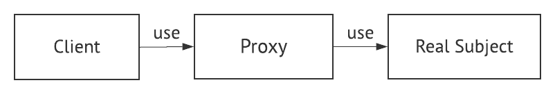
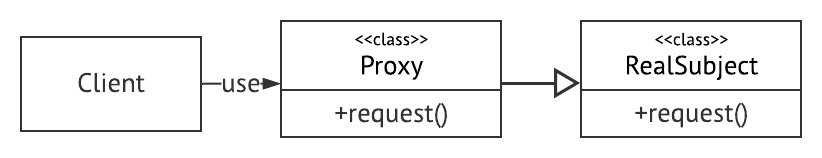
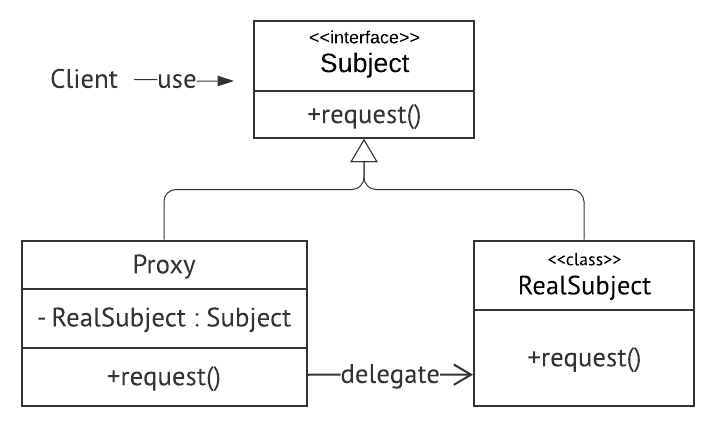

# Proxy Pattern


: Proxy Class를 통해 대신 전달 하는 형태로 설계되며, 실제 Client는 접근하려는 객체(Real Subject)를 바로 접근하는게 아닌 Proxy로 부터 결과를 받는다.
> Proxy: 대리인 이라는 뜻, 뭔가를 대신하여 처리하는것  


주로 logging, 혹은 부가적인 기능을 추가할 때 사용한다. DataJPA Repository, Hibernate Entity 등... 다양한 곳에서 사용한다.

이런 부가적인 기능을 메서드에 직접 코드를 수정해서 추가하는게 어닌 원래 매서드의 코드를 수정하지 않고 부가적인 기능을 추가할 수 있게 하는 패턴이다.
### 특징
#### 장점
- 기존 코드를 변경하지 않고 새로운 기능을 추가할 수 있다.
  > OCP - Open-Close Principle
- 기존 코드가 해야 하는 일만 유지할 수 있다.
  > SRP - Single Responsibility Principle
- 기능 추가 및 초기화 지연 등으로 다양하게 활용할 수 있다.
  > 자원이 큰 객체를 늦게 초기화 하던지 혹은 로깅, 캐싱등 여러가지로 활용할 수 있다. 
#### 단점
- 코드의 복잡도가 증가한다.

## Proxy 패턴 구현 예제


### 1. 상속을 이용한 Proxy - 인터페이스가 없는 경우
메서드 Overried를 이용해 프록시 패턴을 구현한다. - 상속성



- Proxy는 RealSubject를 상속받는다.
- Proxy는 RealSubject의 메서드를 overried한다.

#### 구현
1. `GameService`와 `GameService`의 Proxy객체인 `GameServiceProxy`가 있다.
2. `GameService`는 start라는 매서드를 가진다.
3. 원래 메서드(`GameService.start()`)의 코드를 수정하지 않고 해당 메서드의 수행속도를 측정하고 싶다.
4. `GameServiceProxy`가 `GameService`를 상속받고 부모의 `start()`의 수행속도를 측정한다.

```java
// GameService(Real Subject)
public class GameService{
  public void start() throws InterrubtedException{
    System.out.println("Game Start!!")
  }
}

// GameServiceProxy(Proxy)
public class GameServiceProxy extends GameService {

  @Overried
  public void start() throws InterrubtedException{
    long before = System.currentTimeMillis();
    System.out.println("이 자리에 오신 여러분을 진심으로 환영합니다.");
    Thread.sleep(1000L);
  }
}

public class Client {
  public static void main(String[] args){
    GameService gameService = new GameServiceProxy();
    gameService.start();
  }
}
```
출력 결과 
```sh
Game Start!!
1000
```

#### 사용하는 이유
- Real Subject(ex. `GameService`)를 고칠 수 없는 경우 상속으로 해결한다.
- 인터페이스를 이용한 Proxy구조보다 비교적 단순하다.

하지만 가급적으로 인터페이스를 활용하는게 좋다.

### 2. 인터페이스를 이용한 Proxy
인터페이스를 이용해 프록시 패턴을 구현한다. - 다형성



- Proxy와 RealSubject는 interface인 Subject를 구현한다.
- Proxy는 RealSubject를 가지고 있는다.
- Proxy객체는 RealSubject의 메서드를 대신 실행한다.

#### 구현
1. `GameService` 인터페이스와 그를 구현한 `DefaultGameService`, `ProxyGameService`가 있다.
2. `DefaultGameService`의 proxy는 `ProxyGameService`이고 DefaultGameService를 필드로 가지고 있다.
3. 원래 메서드(`DefaultGameService.start()`)의 코드를 수정하지 않고 해당 메서드의 수행속도를 측정하고 싶다.
4. `GameServiceProxy`는 `DefaultGameService`의 메서드를 대신 실행해 `start()`의 수행속도를 측정한다.

```java
// DefaultGameService(RealSubject)와  ProxyGameService(Proxy)의 Subject 인터페이스
public interface GameService {
    void start() throws InterruptedException;
}

// DefaultGameService(Real Subject)
public class DefaultGameService implements GameService{

    @Override
    public void start() throws InterruptedException {
        System.out.println("Game Start!!!");
        Thread.sleep(1000L);
    }
}

// GameServiceProxy(Proxy)
public class GameServiceProxy implements GameService{

    private final GameService gameService; // proxy를 적용할 RealSubject

    public GameServiceProxy(GameService gameService) {
        this.gameService = gameService;
    }

    @Override
    public void start() throws InterruptedException {
        long before = System.currentTimeMillis();
        gameService.start();
        System.out.println(System.currentTimeMillis() - before);
    }
}

// Client
public class Client {
    public static void main(String[] args) throws InterruptedException {
        GameService gameService = new GameServiceProxy(new DefaultGameService());
        gameService.start();
    }
}
```
출력 결과
```sh
Game Start!!
1000
```

#### 사용하는 이유
- 사용범위가 넓다. ex. 늦은초기화
  ```java
  public class GameServiceProxy implements GameService{

    private final GameService gameService; // proxy를 적용할 RealSubject

    @Override
    public void start() throws InterruptedException {
        long before = System.currentTimeMillis();
        if(gameService == null){
          gameService = new DefaultGameService(); // 야매지만 늦은 초기화를 수행했다.
        }
        gameService.start();
        System.out.println(System.currentTimeMillis() - before);
    }
  }
  ```
- 상속을 이용한 방법보다 조금 더 복잡하다.