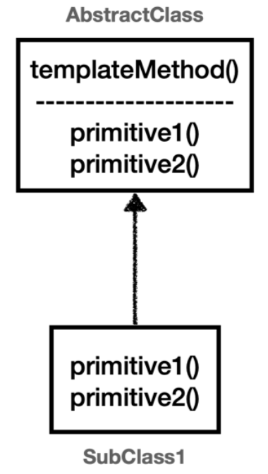

# 템플릿 메서드 패턴 - Template Method Pattern
#### 참고자료
- [김영한 인프런 핵심 원리 - 고급편](https://www.inflearn.com/course/%EC%8A%A4%ED%94%84%EB%A7%81-%ED%95%B5%EC%8B%AC-%EC%9B%90%EB%A6%AC-%EA%B3%A0%EA%B8%89%ED%8E%B8)
- [예제 코드](https://github.com/siwony/spring-core-principle-advanced/tree/main/src/test/java/com/siwony/ifl_spring_advanced/trace/template)

#### 변하는 것과 변하지 않는 것을 분리
GOF의 디자인 패턴에서는 템플릿 메서드 패턴을 다음과 같이 정의한다.
> 작업에서 알고리즘의 골격을 정의하고 일부 단계를 하위 클래스로 연기한다.  
> 템플릿 메서드를 사용하면 하위 클래스가 알고리즘의 구조를 변경하지 않고도 알고리즘의 특정 단계를 재정의할 수 있다.

<p align="center"> </p>

이를 풀어서 설명하면  
부모 클래스에 골격인 알고리즘의 골격인 **템플릿을 정의하고**, 일부분만 자식 클래스에 정의하는 것이다. 이렇게 템플릿 메서드 패턴을 사용하면 **특정 부분만 변경**할 수 있다.

## 예제 - 비즈니스 로직의 수행 속도를 측정하여 로깅하기
> 실습환경: SpringBoot + lombok + junit5
다음과 같이 비즈니스 로직을 실행하는 메서드가 2개( `logic1()`, `logic2()` )가 있다.
```java
@Test
public void executeLogic(){
    logic1();
    logic2();
}

private void logic1() {
    // 비즈니스 로직 실행
    log.info("비즈니스 로직1 실행");
    // 비즈니스 로직 종료
}

private void logic2() {
    // 비즈니스 로직 실행
    log.info("비즈니스 로직2 실행");
    // 비즈니스 로직 종료
}
```
위와 같이 비즈니스 로직를 실행하는 `logic1`, `logic2`가 있다. 이 2개의 메서드에 비즈니스 로식의 수행속도를 측정하고 싶다면 코드를 다음과 같이 추가하면 된다.
```java
@Test
public void executeLogic(){ ... }

private void logic1() {
    long startTime = System.currentTimeMillis();
    // 비즈니스 로직 실행
    log.info("비즈니스 로직1 실행");
    // 비즈니스 로직 종료
    long endTime = System.currentTimeMillis();
    long resultTime = endTime - startTime;
    log.info("resultTime={}", resultTime);
}

private void logic2() {
    long startTime = System.currentTimeMillis();
    // 비즈니스 로직 실행
    log.info("비즈니스 로직2 실행");
    // 비즈니스 로직 종료
    long endTime = System.currentTimeMillis();
    long resultTime = endTime - startTime;
    log.info("resultTime={}", resultTime);
}
```
**출력 예시**
```sh
23:10:25.701 [main] INFO com.siwony.ifl_spring_advanced.trace.template.TemplateMethodTest - 비즈니스 로직1 실행
23:10:25.703 [main] INFO com.siwony.ifl_spring_advanced.trace.template.TemplateMethodTest - resultTime=3
23:10:25.705 [main] INFO com.siwony.ifl_spring_advanced.trace.template.TemplateMethodTest - 비즈니스 로직2 실행
23:10:25.705 [main] INFO com.siwony.ifl_spring_advanced.trace.template.TemplateMethodTest - resultTime=0
```
끝났다 우리는 비즈니스 로직에 대한 수행시간을 측정할 수 있게 되었다. 

하지만 위에 작성한 코드는 다음과 같은 문제를 가지고 있다.
- 메서드에 순수 비즈니스 로직과 부가적인 로직이 섞여 **단일-책임-원칙(SRP)에 위반된다.**
- 비즈니스 로직을 제외한 **수행시간을 측정하는 로직은 계속 중복**되고 있다.
  > 중간에 끼어있는 비즈니스 로직으로 인해 따로 함수화하기도 힘들다.

이러한 문제를 해결하기 위해 템플릿 메서드 패턴을 사용해 보자

#### 비즈니스 로직의 시간을 측정하는 템플릿 추상 클래스 생성
```java
@Slf4j
public abstract class TimeMeasurementTemplate<T> {

    public void execute(){
        long startTime = System.currentTimeMillis();
        // 비즈니스 로직 실행
        T result = call();
        // 비즈니스 로직 종료
        long endTime = System.currentTimeMillis();
        long resultTime = endTime - startTime;
        log.info("resultTime={}", resultTime);
    }

    protected abstract T call();
}
```
`execute()`에서는 변하지 않는 로직 즉, 우리가 중복을 없애고 싶었던 시간 측정을 로직을 템플릿으로 정의하고,  
`call()`에서는 변하는 로직 즉, 함수화를 번거롭게 만들었던 비즈니스 로직을 구현한다.

```java
@Test
void executeLogic(){
    TimeMeasurementTemplate<Void> template1 = new TimeMeasurementTemplate<>() {
        @Override
        protected Void call() {
            log.info("비즈니스 로직1 실행");
            return null;
        }
    };
    template1.execute();


    TimeMeasurementTemplate<Void> template2 = new TimeMeasurementTemplate<>() {
        @Override
        protected Void call() {
            log.info("비즈니스 로직2 실행");
            return null;
        }
    };
    template2.execute();
}
```
**출력 결과**
```sh
23:46:35.475 [main] INFO com.siwony.ifl_spring_advanced.trace.template.TemplateMethodTest - 비즈니스 로직1 실행
23:46:35.477 [main] INFO com.siwony.ifl_spring_advanced.trace.template.code.TimeMeasurementTemplate - resultTime=3
23:46:35.479 [main] INFO com.siwony.ifl_spring_advanced.trace.template.TemplateMethodTest - 비즈니스 로직2 실행
23:46:35.479 [main] INFO com.siwony.ifl_spring_advanced.trace.template.code.TimeMeasurementTemplate - resultTime=0
```
- 이렇게 템플릿 메서드 패턴을 이용해 *시간을 측정하는 로직*과, *비즈니스 로직*를 분리하여 **SRP를 충족했다.**
- 그리고 반복되는 코드가 사라짐으로 **코드의 응집력이 높아졌다.**

#### 하지만, 템플릿 메서드 패턴은 상속이 가진 단점을 그대로 가져간다.
- 자식 클래스가 부모 클래스와 컴파일 시점에 강하게 결합된다.
  > 자식 입장에서는 부모 클래스의 기능을 전혀 사용하지 않는다.  
  > "자식 클래스에서 부모 클래스의 기능을 사용한 것이 있나?"
- 상속 구조를 사용하기 때문에 별도의 `클래스`/`익명 내부 클래스`를 만들어야 해서 구조가 복잡하다.

템플릿 메서드 패턴과 비슷한 역할을 하면서 상속의 단점을 제거할 수 있는 디자인 패턴은 [전략-패턴(Strategy Pattern)](Strategy-Pattern.md)이다.