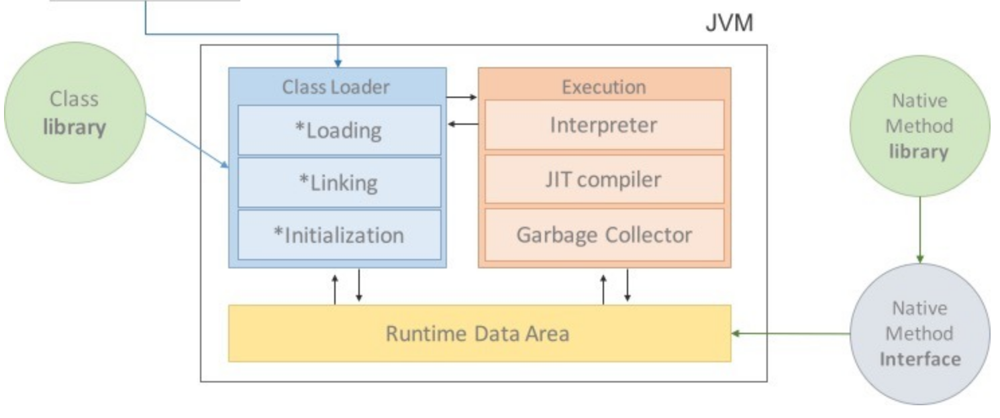
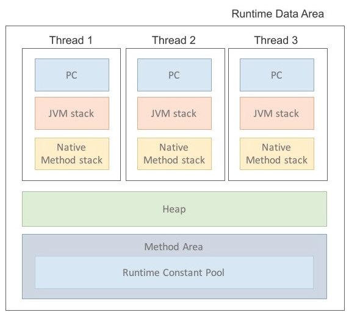
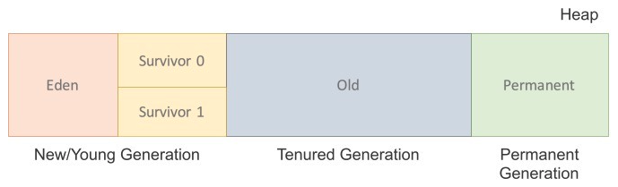

# JVM
> 이 md는 Java7버전 기준으로 작성되었어요... Permanent Generation이 삭제가 되어버리네...?? 그와중에 블로그들 왜 다 java7버전 기준으로 정리함 어이없음 ㅋㅋㅋㅋㅋ 역시 전자정부표준프레임워크의 나라...?

: JVM이란 `Java Virtual Machine`의 약자로 자바 가상 머신이다.

> **가상머신?**  
> : 프로그램을 실행하기 위해 물리적 머신(즉, 컴퓨터)과 유사한 머신을 소프트웨어로 구현한 것

#### 왜 JVM을 알아야 할까? + 동기부여
- 한정된 메모리를 효율적으로 사용하여 최고의 성능을 내기 위해 &rarr; 성능튜닝시 필요하다.
- 코드만 찍어내는 무능한 프로그래머가 아니라 엔지니어로서 내부 동작 원리를 알고 근본적인 문제를 해결하기 위해
- 내가 사용하는 기술 스텍에 대해 자세히 알고 싶어서.

### Java의 목표
#### WORA(Write Once Run Anywhere)
- WORA를 구현하기 위해 물리적인 머신과 별개의 가상 머신을 기반으로 동작하도록 설계되었다.
- 이를 구현한 구현체가 JVM이다.
- Java Byte code를 실행하고자 하는 모든 하드웨어에 JVM을 동작시킴으로 **Java 실행 코드를 변경하지 않고 모든 종류의 하드웨어에서 동작**할 수 있다.
  > 특정 OS에 대한 JVM만 있으면 플랫폼에 상관없이 Java를 실행할 수 있다!

### JVM의 특징
- **스택 기반의 가상 머신** &harr; 레지스터 기반 가상 머신
  > 대표적인 컴퓨터 아키텍처인 인텔 x86 아키텍처나 ARM 아키텍처와 같은 하드웨어가 레지스터 기반으로 동작하는 데 비해 JVM은 스택 기반으로 동작한다.
- **symbolic references(심볼릭 레퍼런스)**
  > `primitive data type`를 제외한 모든 타입(클래스와 인터페이스)을 명시적인 메모리 주소 기반의 레퍼런스가 아니라 심볼릭 레퍼런스를 통해 참조한다.
- **기본 자료형을 명확하게 정의하여 플랫폼 독립성 보장**  
  > C/C++ 등의 전통적인 언어는 플랫폼에 따라 int형의 크기가 변한다.  
  JVM은 기본 자료형을 명확하게 정의하여 호환성을 유지하고 플랫폼 독립성을 보장한다.
- **네트워크 바이트 오더(network byte order)** - 뭔말인지 모르겠다.
  > 인텔 x86 아키텍처가 사용하는 리틀 엔디안이나, RISC 계열 아키텍처가 주로 사용하는 빅 엔디안 사이에서 플랫폼 독립성을 유지하려면 고정된 바이트 오더를 유지해야 하므로 네트워크 전송 시에 사용하는 바이트 오더인 네트워크 바이트 오더를 사용한다.

> #### symbolic references(심볼릭 레퍼런스)
> : 참고하는 클래스의 특정 메모리 주소를 참조 관계로 구성한 것이 아닌 참조하는 대상의 이름만을 지칭한 것이다.  
> Class 파일이 JVM에 올라가게 되면 Symbolic Reference는 그 이름에 맞는 객체의 주소를 찾아서 연결하는 작업을 수행한다.  
> 그러므로, 실제 메모리 주소가 아니라 이름만을 가진다.

### JVM의 역할
- Java 애플리케이션을 `Class Loader`를 통해 읽어 들여 자바 API와 함께 실행한다.
- JVM은 자바와 OS사이에서 중개자 역할을 수행하여 OS에 독립적인 플랫폼을 갖게 해준다.
  > OS의 메모리에 직접접근하는 것이 아닌 JVM이라는 가상 머신을 통해 간접적으로 접근한다.
- `GC(Garbage Collector)`  
  : JVM이 GC를 통해 자동으로 메모리를 관리 해준다.

### Java프로그램 실행과정
> JVM 구성을 알기전에 Java프로그램의 실행과정을 알아보자

1. 프로그램이 실행되면 JVM은 OS로부터 이 프로그램이 필요로 하는 메모리를 할당받는다.
   > JVM은 이 메모리를 용도에 따라 여러 영역으로 관리한다.
2. 자바 컴파일러(javac)가 Java 소스 코드(`.java`)를 읽어 Java 바이트 코드(`.class`)로 변환한다.
3. JVM의 `Class Loader`를 통해 `.class` 파일들을 JVM으로 로딩한다.
4. 로딩된 `.class`파일들을 `Excution engine`을 통해 해석된다.
5. 해석된 byte code는 `Runtime Data Area` 에 배치되어 실질적인 수행이 이루어진다.
   > 이러한 과정속에서 JVM은 필요에 따라 GC같은 관리 작업을 수행한다.

# JVM의 구성

> 클래스 로더(Class Loader)가 컴파일된 `Java byte code`를 런타임 데이터 영역(Runtime Data Areas)에 로드하고, 실행 엔진(Execution Engine)이 `Java byte code`를 실행한다.

## 1. Class Loader(클래스 로더)
: JVM내로 클래스(`.class`)를 로드하고, 링크를 통해 배치하는 작업을 수행하는 모듈이다.
### 1 - 1. 특징
- **동적 로드**  
  : 컴파일 타임이 아닌 런타임에 클래스를 처음으로 참조할 때 해당 클래스를 로드하고 링크한다.
- **계층 구조 - Hierarchical**  
  : 클래스 로더끼리 부모-자식 관계를 이루어 계층 구조로 생성된다.
    > 최상위 클래스 로더는 부트스트랩 클래스 로더(Bootstrap Class Loader)이다.
- **로딩 요청 위임 - Delegate Load Request**  
  : 계층 구조를 바탕으로 클래스 로더끼리 로드를 위임하는 구조로 동작한다.
    > 클래스를 로드할 때 먼저 상위 클래스 로더를 확인하여 상위 클래스 로더에 있다면 해당 클래스를 사용하고,  
    > 없다면 로드를 요청받은 클래스 로더가 클래스를 로드한다.
- **가시성 제약 조건 - Have Visibility Constraint**  
  : 하위 클래스 로더는 상위 클래스 로더의 클래스를 찾을 수 있지만, 상위 클래스 로더는 하위 클래스 로더의 클래스를 찾을 수 없다.
- **언로드 불가 - Cannot unload classes**  
  : 클래스 로더에 의해 로딩된 클래스들은 다시 JVM상에서 없앨 수 없다.
  > 언로드 대신, 현재 클래스 로더를 삭제하고 아예 새로운 클래스 로더를 생성하는 방법을 사용할 수 있다.

### 1 - 2. 클래스 로드 과정
자바의 동적 로딩 기능은 클래스로더 서브 시스템에 의해 처리된다.
컴파일 시점이 아닌 클래스를 처음 참조하는 런타임 시점에 Loading, Linking, Initialization 작업이 이루어진다.

#### 1) Loading - 로딩
Bootstrap, Extension, Application 컴포넌트들에 의해 클래스들이 로드되며,  
이 세가지 클래스 로더들은 모두 상속관계로 정의되어 있으며 delegate(위임) 방식으로 작업을 진행한다.

- **Bootstrap ClassLoader**
  - JVM을 가동할 떄 생성되며, 자바가 아닌 네이티브 코드로 구현되어 있다.
  - jre의 lib폴더에 있는 rt.jar 파일을 찾아 자바 API들을 로드하여 이 로더가 우선 순위가 가장 높다.
- **Extension ClassLoader**
  - 기본 자바 API를 제외한 확장 클래스를 로드한다.
    > 다양한 보안 확장 기능 등을 여기에서 로드하게 된다.
  - jre의 lib폴더에 있는 모든 확장 코어 클래스 파일들을 로드한다.
- **Application ClassLoader**
  - Extension ClassLoader의 자식이며 시스템 `클래스로더 - System ClassLoader`라고 불린다.
    > Application 레벨에 있는 클래스를 로드한다. 즉, 사용자가 지정한 $CLASSPATH내의 클래스를 로드한다.

#### 2) Linking - 연결
- `verify - 검증` : 바이트코드 검증기는 생성된 자바 바이트코드가 적절한지 대해 검증한다.
  - 검증이 실패할 경우 검증오류를 발생시킨다.
- `prepare - 준비` : 모든 정적변수의 메모리가 할당되며 기본 default 값으로 할당한다.
- `resolve - 해석` : 모든 심볼릭한 메모리 참조를 메서드 영역에 있는 타입으로 직접 참조한다.

#### 3) Initialize - 초기화
모든 정적 변수가 자바 코드에 명시된 값으로 초기화되며 정적 블록이 실행 된다.

## 2. Execution Engine(실행 엔진)
런타임 데이터 영역에 할당된 바이트 코드는 실행엔진에 의해서 실행된다.
- 그래서 실행 엔진은 `byte code`를 JVM내부에서 기계가 실행할 수 있는 형태로 변경한다.
- 이 때 두가지 방법을 사용한다. (Interpreter, JIT)
- 실행 엔진이 어떻게 동작하는지는 JVM 명세에 규정되지 않았다.
  > 표준이 없어 여러 JVM 벤더들은 다양한 기법으로 실행 엔진을 향상시키고 다양한 방식의 JIT컴파일러를 도입하고 있다.

### 2-1. Interpreter(인터프리터)
: `Java byte code`를 명령어 단위로 읽어 실행하는 방식
- 한줄씩 실행하기 때문에 느리다는 단점을 가지고 있다.

### 2-2. JIT(Just In TIme)
: 인터프리터 방식으로 실행하다 적절한 시점에 `byte code`를 컴파일하여 *native code*로 변경한 후 더는 인터프리팅하지 않고 *native code*를 직접 실행하는 방식 
- 네이티브 코드는 캐시에 저장되어, 한번 컴파일된 코드는 빠르게 실행된다.
- 하지만, JIT컴파일러가 컴파일하는 과정은 `byte code`를 인터프리팅 하는 것보다 느리다.
  > 한 번만 실행될 코드는 인터프리팅하는게 이득이다.
- JIT컴파일러를 사용하는 JVM은 내부적으로 해당 메서드의 수행을 체크하고, 일정 정도를 넘을 때 컴파일을 수행한다.

#### 2-3 GC(Gabage collector)
아무 참조가 없는 인스턴스를 모아 제거하는 역할.

## 3. Runtime Data Area - Java 7기준
> 시간이 된다면 Java8버전 이후 JVM의 메모리 구조를 정리해야겠다.

: JVM이 Java ByteCode를 실행하기 위해 사용되는 메모리 공간이다.
- 크게 5가지 영역으로 구분할 수 있다.
  > Method Area, Heap Area, Stack Area, PC Registers, Native Method Stacks

### 3 - 1. Method Area - 메서드 영역
- 모든 클래스 수준(클래스명, 부모클래스명, 메소드, 변수)의 데이터가 저장된다.
- 공유자원 + JVM당 한개의 영역을 가지고 있다.

### 3 - 2. Heap(힙 영역)
- 모든 인스턴스 오브젝트(클래스, 배열 등)가 저장되는 공간이다.
- **GC의 관리 대상이다.**
- 물론 class 영역에 올라온 클래스들만 객체로 생성할 수 있다.
- 당 하나의 영역밖에 존재하지 않으며 또한 공유자원이다.

Java7 버전까지의 Heap은 크게 3가지부분으로 나눌 수 있다.
  > Permanent Generation(제거 됨), New/Young Generation, Tenured Generation  

Java8 이후 메모리 구조  

#### 1) Permanent Generation - Java8부터 제거됨
> Permanent Generation가 제거되고, OS 레벨에서 관리되는 Native 메모리 영역에 Metaspace 가 추가되었다.

: 생성된 객체들의 정보의 주소값이 저장된 공간이다.
- Class loader에 의해 로드되는 class나 method 등에 대한 Meta 정보가 저장되며 JVM에 의해 사용된다.
- 내부적으로 Reflection 기능을 사용하는 Spring Framework를 이용할 경우, 이 영역에 대한 고려가 필요하다.
- Permanent Generation영역은 Java8부터 제거되고 native영역 중 Metaspace가 생겼다.

### 3 - 3. Stack Area - 스택 영역
- `여러형태의 변수/임시 데이터`, `threed/method 정보`, `지역변수`, `매개변수`, `리턴 값`, `연산시 일어나는 값들`을 저장한다.
- 각각의 thread마다 개별의 스택영역이 존재한다.
- 메서드 호출시 각각의 스텍 프레임(해당 메서드만을 위한 공간)이 생성된다.
- 메서드 수행이 끝나면 스텍 프레임 별로 삭제한다.

#### 1) 스택 프레임의 세가지 서브 엔티티
- `지역변수 배열 - Local Variable Array`: 메서드의 지역변수의 개수와 해당하는 값에 대한 정보를 담고있다.
- `피연산자 스택 - Operand Stack`: 중간연산이 필요로 할 때, 연산작업을 수행하기 위한 작업공간이다.
- `프레임 데이터 - Frame Data`: 메서드에 해당하는 심볼이 저장된다.

### 3 - 4. PC Register
: Threed가 어떤 부분을 어떤 명령으로 실행해야할 지에 대한 부분을 기록하는 부분이다.
- Threed가 시작될때 생성되며, Threed마다 하나씩 존재한다.
- 현재 수행중인 JVM 명령어의 주소를 갖는다.

### 3 - 5. Native Method stack
실제 실행할 수 있는 기계어로 작성된 프로그램을 실행시키는 영역
> Java 프로그램이 컴파일되어 생성하는 바이트코드가 아니다. 즉, Java가 아닌 다른언어로 작성된 코드를 위한 공간이다.
- Java Native Interface를 통해 바이트 코드로 전환하여 저장한다.
- 일반프로그램처럼 커널이 스텍을 잡아 독자적으로 프로그램을 실행시키는 영역이다.
  > C언어의 code를 실행시켜 커널에 접근이 가능하다!

#### New/Young Generation
1. Eden 영역에서 minor GC가 일어날 때
2. Eden 영역에 있는 값들을 Survivor 0 혹은 1 영역에 복사하고
3. 이 영역을 제외한 나머지 영역의 객체를 삭제한다.

Eden : 객체들이 최초로 생성되는 공간.  
-  여기에 객체가 가득차게 되면 첫 번째 GC(minor GC)가 발생한다.

Survivor 0/1 : Eden에서 참조되는 객체들이 저장되는 공간

#### Tenured Generation
: New Generation에서 일정 시간 참조되며 살아있는 객체들이 저장되는 공간이다.
- 접근 불가능 상태로 되지 않아 Young 영역에서 살아남은 객체가 여기로 복사된다.
- 이 영역에서 객체가 사라질 때 Major GC가 발생한다고 말한다.

#### 객체의 소멸과정
 1. Eden영역에 객체가 가득차게 되면 첫번째 GC가 발생한다.
 2. Eden영역에 있는 값들을 Survivor0 혹은 1영역에 복사한다.
 3. 나머지 영역의 객체를 삭제한다.

### 3-5 Method Area(== Class area == Static area)
: 클래스 정보를 처음 메모리공간에 올릴 때 초기화되는 대상을 저장하기 위한 메모리 공간
- 올라가게 되는 메서드의 `byte code`는 프로그램의 흐름을 구상하는 `byte code`이다.
    > Java 프로그램은 main 메서드의 호출로 흐름을 이어가기 때문이다!
- 사실상 컴파일 된 `byte code` 대부분이 메서드 `byte code`이므로 거의 모든 `byte code`가 올라간다.
- **Runtime Constant Pool**이라는 별도의 관리영역도 존재한다.
  > 참조 자료형을 저장하요 참조하고 중복을 막아준다.

올라가는 정보의 종류
- Field Information  
  > 맴버변수의 이름, 데이터 타입, 접근 제어자의 대한 정보
- Method Information
  > 메서드의 이름, 데이터 타입, 접근 제어자의 대한 정보
- Type Information
  > class혹은 interface여부, type의 속성, 전체 이름, super class의 전체이름(interface, Object 제외)

