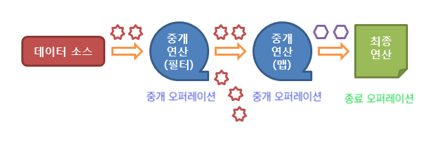

#### 먼저 숙지해야 하는 것
> 숙지하지 않아도 사용할 수 있지만, Stream은 여러 메서드에서 함수형 인터페이스를 사용하므로 숙지하는게 좋다.
- 람다 표현식
- 메서드 레퍼런트
# Stream
: 연속적인 요소(element)들에 대한 `순차`/`병렬` `aggregate operations`를 지원하는 API이다.
> Sequence of elements supporting sequential and parallel aggregate operations
- 데이터를 담는 저장소(ex. Collecation)이 아니다. 
- 대부분의 오퍼레이션의 인수는 함수형 인터페이스를 받으므로 람다, 메서드 레퍼런스를 활용한 개발이 가능하다.
- Functional in nature, Stream이 처리하는 데이터 소스는 변경하지 않는다.
- `Stream`으로 처리하는 데이터는 오직 한 번만 처리된다.
- 무제한일 수 있다. &rarr; 실시간으로 들어온 데이터를 처리할 수 있다.
  > `Short Circult` 메서드를 사용해 제안할 수 있다.
- 중개 오퍼레이션은 Lazy 하다. &rarr; 종료 오퍼레이션이 오지 않는 이상 실행되지 않는다.
- 쉬운 병렬처리가 가능하다.
  > `parallelStream()` 으로 가능하다. 하지만 오히려 threed를 사용해 비용이 증가할 수 있다.


### Stream 파이프라인


- 0 또는 다수의 `중개 오퍼레이션 - intermediation operation`과  한개의 `종료 오퍼레이션 - terminal operation`으로 구성한다.
- Stream의 데이터 소스는 오직 종료 오퍼레이션을 실행할 때 처리한다.

#### 중개 오퍼레이션
- **Stream을 리턴한다.**
- Stateless / Stateful 오퍼레이션으로 구분할 수 있다.
  > 대부분 Stateless이다.
- Filtering - `filter()`, `distinct()`
- Mapping - `map()`, `flatMap()`
- Restricting - `limit()`, `skip()`
- Sorting - `sorted()`
- Iterating - `peek()`
> 버전에 따라 추가되거나 삭제될 수 있다.


#### 종료 오퍼레이션
- **Stream을 리턴하지 않는다.**
- Stream에 대한 최종연산을 수행한다.
- `collect`, `allMatch`, `count`, `forEach`, `min`, `max` 등...

### 사용 예시
등록된 온라인 강의를 특정 조건에 따라 검색하는 예시
- `OnlineClass` 객체의 이름의 첫 시작, 종강여부에 따라 검색할 것이다.

#### OnlineClass 객체
```java
public class OnlineClass {
    public String username;
    public String className;
    public boolean isClosed;

    static boolean isClosed(OnlineClass oc){
        return oc.isClosed;
    }

    public OnlineClass(String username, String className, boolean isClosed){
        this.username = username;
        this.className = className;
        this.isClosed = isClosed;
    }
}
```
#### 실제 로직
```java
public static void main(String[] args) {
    // 강의 저장
    List<OnlineClass> onlineClasses = new ArrayList<>(
            Arrays.asList(          // 강사이름  // 강의 이름             //종강 여부 
                    new OnlineClass("egoging", "WEB class HTML/CSS/JS", false),
                    new OnlineClass("egoging", "WEB + AI", true),
                    new OnlineClass("김영한", "JPA 실전 강의", false),
                    new OnlineClass("김영한", "JPA 활용 실전 강의", true)
            )
    );

    // 강의 이름이 WEB으로 시작하는 수업 필터링 
    System.out.println("=== 이름이 WEB으로 시작하는 수업 ===");
    onlineClasses.stream()
            .filter(oc -> oc.className.startsWith("WEB"))
            .forEach(oc -> System.out.println(oc.className));
    System.out.println(); // 한칸 줄바꿈을 위한 코드

    // 종강된 수업 필터링
    System.out.println("=== 종강된 수업 ===");
    onlineClasses.stream()
            .filter(OnlineClass::isClosed) // 부정 연산을 사용할 떄 Predicate.not(OnlineClass::isClosed)
            .forEach(oc -> System.out.println(oc.className));
    System.out.println(); // 한칸 줄바꿈을 위한 코드

    // 종강되지 않은 수업 필터링
    System.out.println("=== 종강되지 않은 수업 ===");
    onlineClasses.stream()
        .filter(Predicate.not(OnlineClass::isClosed))
        .forEach(oc -> System.out.println(oc.className));
}
```
#### 결과
```sh
=== close된 수업 ===
WEB + AI
JPA 활용 실전 강의

=== 이름이 WEB으로 시작하는 수업 ===
WEB class HTML/CSS/JS
WEB + AI

=== 종강되지 않은 수업 ===
WEB class HTML/CSS/JS
JPA 실전 강의
```