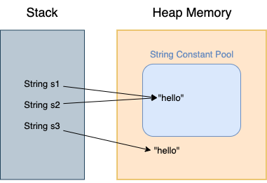
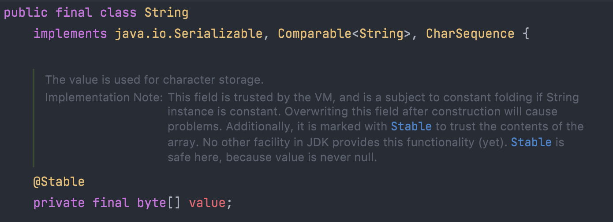

# String class
Java를 만든 사람들은 객체지향 언어를 설계할 때 모든 것을 객체로 만들지 않고 `원시형 - Primitive Type`를 보유하여 성능을 개선했다.  
> 원시형은 스택 영역에 저장되고, 객체는 힙 영역에 저장되므로 힙 영역은 메모리 관리가 복잡하고 공간을 스택 영역 보다 더 차지한다.

자바의 String은 원시형과 클래스 사이의 형태로 설계되었다.

### String의 특별한 기능
#### 1. `+`연산자 오버로딩
Java는 SW공학 관점에서 오버로딩을 지원하지 않는다.  
하지만, **Java에서는 오직 문자열 더하기 연산을 위해 `+`만 오버로딩 되어 있다.** [참고자료](http://egloos.zum.com/js7309/v/11155465)

내부 동작을 간단하게 설명하자면 String형의 `+` 연산은 내부적으로 `StringBuilder.append()`를 사용해서 문자열을 연결한다.
> C, C++은 연산자 오버로딩을 지원한다. `+`연산자를 `-`가 동작하도록 만들 수 있다!

#### 2. 기본형처럼 문자열 리터럴로 초기화 할 수 있다.
String의 초기화는 직접 문자열 리터럴로 초기화 하거나, new 연산자로 초기화할 수 있다.

하지만 new 연산자로 초기화 하는 방법은 권장하지 않는다. 그 이유는 `String`리터럴로 생성된 String 값은 Heap 영역 내 **String Constant Pool에 저장이 된다.** 

### String Constant Pool
> 앞으로 String Pool이라고 부를 것이다.
```java
String s1 = "hello";
String s2 = "hello";
System.out.println(s1 == s2); // true 출력

String s3 = new String("hello");
System.out.println(s2 == s3)// false 출력
```
s1과 s2는 *String Constant Pool*에 저장된 값을 공유하므로 동일비교(`==`)를 하면 true가 출력되지만,  
`new` 연산자를 사용한 s3같은 경우 s2와 `==`비교를 하면 false가 출력된다.

위의 코드를 그림으로 나타내면 아래와 같다.  


#### String Constant Pool의 변천사
Java6 이전에는 String Constant Pool은 Heap메모리에 존재하지 않고 Permenent Generation 메모리에 있었다.

Java 7 버전에서는 PermGen이 아닌 Heap 메모리 영역으로 옮겼다.  
그렇기 때문에 메모리가 한정적인 PemGen에서 Strirng Pool 메모리 사이즈 때문에 걱정하는 일이 사라졌다.

#### String Table Size
Java String Pool은 기본적으로 HashTable 구조를 가지고 있다.
그래서 String Pool은 좋은 성능을 자랑한다.


### String class의 내부 
> 본 글은 OpenJDK11 기준으로 작성되었습니다.



String class의 일부분을 가져왔다. String class는 final로 선언되어 상속해서 사용할 수 없다.  

그리고 String class는
- 직렬화를 위한 `Serializable`
- 비교를 위한 `Comparable`
- read-only를 위한 `CharSequence`
  > `length()`, `charAt()`과 같은 문자열 조회 기능을 추상화한 인터페이스이다.

위에 3가지 인터페이스를 구현한 클래스이고,  

### String은 불변이다.
위 사진에서 `private final byte[] value;`로 선언된 배열이 있다. 이 상수배열은 String class에서 실질적인 값을 가지고 있는 상수이다.

```java
String s = "hello";
s = "hello world";
```
위에 코드는 `String` 클래스의 내부적인 값이 바뀐 것처럼 오해할 수 있지만 사실은 새로운 `String`객체가 대입된 것이라고 할 수 있다.
`toUpperCase()`, `trim()`과 같은 메서드도 사실은 새로운 String 객체를 반환한다.

[Java Oracle String 공식문서](https://docs.oracle.com/javase/7/docs/api/java/lang/String.html)에 String이 불변이라는 것에 대한 글이 기술되어 있다.

#### 비 효율적인 코드
`String`이 불변이므로 비 효율적인 코드가 발생하는데
```java
String str = "Hello";
for (int i = 1; i < 1000; ++i) {
    str = str + i;
}
```
위 코드는 같은 경우 str변수에 문자가 이어 붙여지는 것이 아닌 새로운 String 객체가 1000번 생성되는 코드이다. 

이러한 문제를 해결하기 위해 `StringBuilder`와 `StringBuffer`를 사용해야 한다.

다음글: [`StringBuilder`와 `StringBuffer`]()