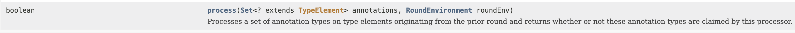

# 어노테이션 프로세서 - Annotation Processor
[Oracle 공식문서](https://docs.oracle.com/javase/8/docs/api/javax/annotation/processing/Processor.html)

Lombok의 `@Getter` `@Setter` annotation으로 getter/setter를 생성해준다. 어노테이션 프로세서라는 기술은 Lombok 같이 코드를 자동으로 생성해 줄 수 있을 뿐만 아니라 모든 파일을 만들어 낼 수 있다.

#### Lombok의 동작원리
컴파일 시점에 어노테이션 프로세서를 사용하여 소스코드의 **AST(abstract syntax tree)** 를
조작한다.

### 어노테이션 프로세서란?
자바 컴파일러 플러그인의 일종으로, 어노테이션에 대한 코드베이스를 검사, 수정, 생성 및 문서와 같은 파일을 생성할 수 있는 기술이다.
- 컴파일 단계에서 작동한다.
- AST(abstract syntax tree)를 조작할 수 없다.
  > Annotation이 붙어있는 클래스를 참조할 수 있지만 수정할 수 없다.

#### 하지만 어떻게 lombok은 수정할 수 있나요?

공개된 API가 아닌 컴파일러의 내부 클래스를 이용해 기존 소스 코드를 조작한다. &rarr; 이를 해킹이라고 주장하는 의견이 있다.
- 공식 API가 아니므로 호환성의 문제가 생길 수 있다.

AST를 수정하지 않고 정석적인 방법을 사용한 라이브러리
- [AutoValue](https://github.com/google/auto/blob/master/value/userguide/index.md)
- [Immutables](https://immutables.github.io)

하지만 다들 lombok처럼 편리성을 제공해주지 못한다.

### 어노테이션 프로세서의 동작원리
- Round에 의해서 동작한다.
  > **round**  
  > : 각 round마다 Processor에게 특정한 어노테이션들이 가지고 있는 앨리먼트를 가지고 있다면 프로세서가 해당 결과를 처리한다.

### 장점
- 런타임 비용이 없다.
  > 컴파일 할 때 조작되어 사용되기 때문에 비용이 드는게 아니다.

### 단점
- 기존의 코드를 고치는 공식적인 방법이 없다.
  > lombok은 해킹을 통해 하고있다.