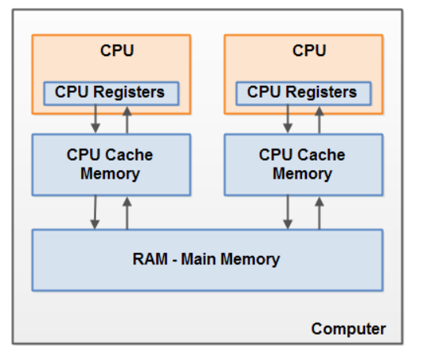

# Volatile - 메모리 가시성을 해결하는 방법
`volatile` 키워드는 Java `"변수를 Main Memory에 저장하겠다"`라는 것을 명시하는 것이다.

모든 volatile 변수는 컴퓨터의 메인 메모리로 부터 읽히고, volatile 변수에 대한 쓰기 작업은 메인 메모리로 직접 이루어진다. 즉, CPU cache를 사용하지 않는다.

#### 키워드 선언 방식
```java
private volatile int counter;
```

### 가시성이란?


보통 CPU가 메인 메모리에 접근이 필요할 때, RAM &rarr; Cache &rarr; CPU Register 순으로 읽은 후 명령을 수행한다 그리고 데이터를 메인 메모리에 저장하기 위해 이 과정을 역순으로 한다.

volatile 변수를 사용하고 있지 않는 MultiThread 어플리케이션에서는 Task를 수행하는 동안 성능 향상을 위해 Main Memory에서 읽은 변수 값을 CPU Cache에 저장하게 된다.

만약 Multi Thread환경에서 Thread가 `공유되는 변수 값을 읽어올 때` 각각의 Cache Memory에 저장된 값이 다르므로 인해 변수 값 불일치가 발생하게 된다.

에제는 제이온님의 블로그가 더 잘 나와있는 거 같아 첨부하겠다. https://steady-coding.tistory.com/555

### volatile 키워드의 특징
- 특정 변수에 대해서 최신 값을 제공한다.
  > 하지만 원자성을 보장하지 않는다. 즉, race condition를 해결해 주지 않는다.
- CPU의 cache를 활용하지 못하고 그 이외에 성능 이슈가 존재한다.
  - 대표적으로 JVM 성능 향상을 위한 코드 재정리를 막는다.
- 32 bit 변수에서만 기능을 보장한다.

요약. **변수의 가시성 보장이 반드시 필요한 경우에만 사용하자**