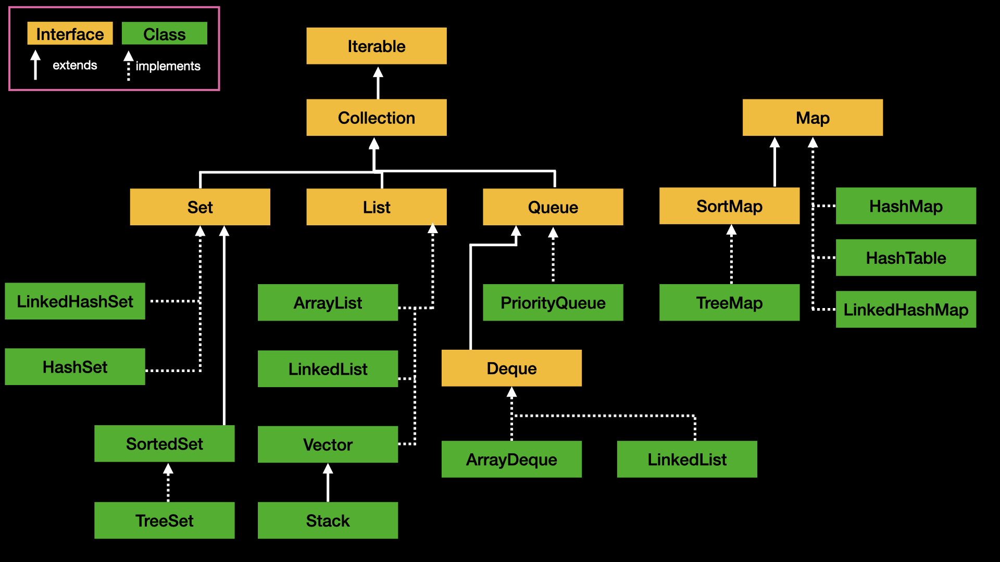

# JCF - Java Collection Framework
Java Collection Framework는 공통적으로 재사용 가능한 수집 데이터 구조를 구현하는 클래스 및 인터페이스의 집합이다.

### JFC 상속 구조

### 컬렉션 프레임워크 구성요소
- 컬렉션 인터페이스 : 모든 컬렉션 인터페이스 `java.util`패키지에 있다.
- 컬렉션 클래스     : 모든 컬렉션 클래스는 `java.util`, `java.util.concurrent` 패키지에 있다.
- 컬렉션 알고리즘   : 검색, 정렬, 셔플과 같은 기능을 제공한다.

## 1. 컬렉션 인터페이스 - Collection Interface
- 공식문서 : https://docs.oracle.com/javase/8/docs/api/java/util/Collection.html
#### 컬렉션 프레임워크 대표적인 인터페이스
- `List<E>`
- `Set<E>`
- `Map<K, V>`

### 1-1. Collection 인터페이스
`Collection`인터페이스는 직접적인 구현은 제공하지 않으며 모든 컬렉션 클래스가 구현해야 하는 메서드를 포함하고 있다.

### 1-2. List 
- 순서 있는 데이터의 집합으로 데이터의 중복을 허용한다.
- Random access를 허용한다.
- `ArrayList`, `LinkedList`, `Vector`, `Stack`

### 1-3. Set 인터페이스
- 중복 요소를 포함할 수 있다.
- Random access를 허용하지 않는다.
  > `LinkedHashSet` 제외
- `HashSet`, `TreeSet`, `LinkedHashSet`

### 1-4. SortedSet 인터페이스
요소를 오름차순으로 유지하는 Set이다.
- 구현체는 `TreeSet`이 있다.

### 1-5. Queue 인터페이스
Queue 인터페이스는 처리하기 전에 요소를 보유하는 데 사용된다.
- 기본 컬렉션 작업 이외에 삽입, 추출 및 검사 작업을 제공한다.
- 일반적으로 Queue 요소를 FIFO 방식으로 정렬하며 예외에는 `우선순위 큐 - PriorityQueue`가 있다.

### 1-6. Deque
양쪽 긑에 요소 삽입 및 제거를 지원한다.
- 구현된 글래스는 ArrayDeque가 있다.

## 2. Map 인터페이스
- Key-Value
- 중복 Key가 존재할 수 없다.
- 각 키는 하나의 값만 매핑할 수 있다.
- `HashMap`, `TreeMap`, `LinkedHashMap`, `Hashtable`, `Properties`

### 2-1 SortedMap 
매핑을 오름차순의 키 순서로 유지하는 Map이다.
- 구현체는 `TreeMap`이 있다.

## 3. 기타 인터페이스 그룹

### 3-1. Iterator 인터페이스
Iterator 인터페이스는 어떤 컬렉션이든 반복적으로 수행하기 위한 메서드를 제공한다.
- 컬렉션 프레임워크에서는 `Enumeration`대신 `Iterator`를 사용한다.
- Iterator 디자인 패턴을 구현한다.
- `iterator()`를 통해 컬렉션으로 부터 Iterator instance를 가져올 수 있고 컬렉션을 순회하는 도중에 엘리먼트를 삭제할 수 있다.

### 3-2. ListIterator 인터페이스
- 어느 방향이든 목록을 탐색하고 반복하면서 목록을 수정하고, 목록에서 반복자의 현재 위치를 가져올 수 있다
- 커서 위치는 `previous()`, `next()`에 대한 호출에 의해 반환될 요소 사이에 위치한다.

### 3-3. Concurrent 인터페이스 그룹
- `BlockingQueue` 
- `TransferQueue`
- `BlockingDeque`
- `ConcurrentMap`
- `ConcurrentNavigableMap`

## 4. 컬렉션 클래스 - Collection Class
`ArrayList`, `LinkedList`, `HashSet`, `TreeSet`, `PriorityQueue`, `ArrayDeque`, `HashMap`, `TreeMap`, `LinkedHashMap`, `Vector`, `Stack`, `Dictionary`, `Hashtable`, `Properties`

#### Concurrent 클래스
`CopyOnWriteArrayList`, `CopyOnWriteArraySet`, `ConcurrentHashMap`

#### Abstract 클래스
`AbstractList`, `AbstractSequenctailList`, `AbstractSet`, `AbstractQueue`

### 4-1. ArrayList 클래스
- resizable-array이면서 비동기이다.
  > 동기화가 필요하면 `Collections.synchronizeList()`를 통해 동기화가 보장되는 List를 반환받아 사용한다.
- `ArrayList`는 내부적으로 배열을 이용하여 요소를 저장한다.
- thread-safe하지 않다.

### 4-2. LinkedList 클래스 
- `Queue`, `Deque` 속성 메서드를 가지고 있다.
- `Queue`, `Deque`의 메서를 포함하고 있따.
- 내부적으로 연결 리스트를 이용한다.
- thread-safe하지 않다.

### 4-3. HashSet 클래스
`HashMap`에 의해 지원되는 Set 인터페이스의 구현체이다.
- 요소의 순서를 보장하지 않는다.
- null를 허용한다
- - thread-safe하지 않다.

### 4-4. TreeSet 클래스
`TreeMap`의 근본이 되는 `NavigableSet` 구현이다.
- thread-safe하지 않다.

### 4-5. PriorityQueue 클래스
우선순위 큐
- thread-safe하지 않다.

### 4-6. ArrayDeque
`Deque`인터페이스의 동적 배열 구현체 이다.
- thread-safe하지 않다.

## 5. Map 인터페이스 그룹의 클래스
### 5-1. HashMap 클래스
- threa-safe하지 않다.
- null를 허용하지 않는다.
- 앨리먼트의 순서를 보장하지 않는다.

### 5-2. TreeMap 클래스
- Red-Baclk 트리 기반 `NavigableMap`의 구현체다.
- thread-safe하지 않다.

### 5-3. LinkedHashMap 클래스
- `LinkedHashMap`
- null를 허용한다.