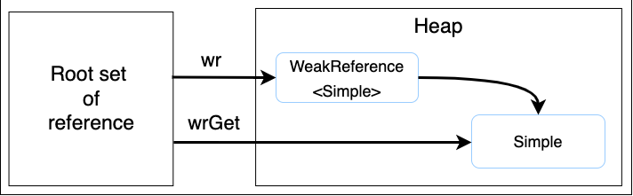
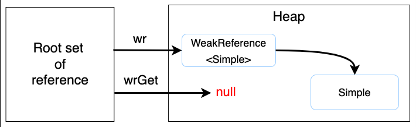

# Java Reference와 GC
최초의 Java에서는 GC작업에 애플리케이션의 사용자 코드가 관여하지 않도록 구현되어 있었지만 GC작업에서 좀 더 다양한 방법으로 객체를 처리하기 위해 JDK1.2부터 `java.lang.ref` 패키지를 추가하여 제한적으로 사용자 코드와 GC가 상호작용할 수 있게 되었다.

### java.lang.ref
`java.lang.ref` 패키지는 `strong reference` 이외에 `soft`, `weak`, `phantom` 3가지의 새로운 참조 방식을 각각 `Reference` 클래스로 제공한다.

> #### strong reference 란?
> `A a = new A()`코드에서 변수`a`가 생성된 `A`객체를 참조하는 것 과 같이 전형적으로 객체를 참조하는 방식을 의미한다.  
> 강한 참조를 통해 참조되고 있는 객체는 가비지 컬렉션의 대상에서 제외된다.

#### java.lang.ref.Reference는 어떻게 활용할 수 있나요?
- GC에 일정 부분 관여할 수 있다.
- `LRU - Least Recently Used` 캐시 와 같이 특별한 작업을 하는 애플리케이션 작성

## 1. 가비지 판단 기준
**Java GC는 객체가 가비지인지 판별하기 위해 reachability라는 개념을 사용한다.**
- 어떤 객체에 유효한 참조가 있으면 `reachable`
- 어떤 객체에 유효한 참조가 없다면 `unreachable`

가비지 판단 기준은 2가지로 나뉘고, `unreachable`객체를 가비지로 간주해 GC를 수행한다.

한 객체는 여러 다른 객체를 참조하고, 참조된 다른 객체들도 또 다른 객체들을 참조할 수 있으므로 객체들은 참조 사슬을 이룬다. 이 상황에서 **유효한 참조 여부를 파악하려면 유효한 최초의 참조가 있어야 하는데 이를 `객체 참조의 root set`** 이라고 한다.

#### root set의 종류 
힙에 있는 객체들에 대한 참조는 4가지 종류가 있는데
1. 힙 내의 다른 객체에 의한 참조
2. **Java 스택, 즉 Java 메서드 실행 시 사용하는 지역 변수와 파라미터들에 의한 참조**
3. **네이티브 스택, 즉 JNI에 의해 생성된 객체에 대한 참조**
4. **메서드 여역에 정적 변수에 의한 참조**

이들 중 **`1. 힙 내의 다른 객체에 의한 참조`를 제외한 나머지 3개(2, 3, 4)가 root set으로 reachability를 나누는 기준이 된다.**

## 2. Soft, Weak, Phantom Reference와 Reachability
`java.lang.ref`는 soft/weak/phantom reference를 클래스 형태로 제공한다. [java.lang.ref 공식 문서](https://docs.oracle.com/javase/7/docs/api/java/lang/ref/package-summary.html)

Soft/Weak/Pantom Reference 객체는 다른 객체와 달리 Java GC가 특별하게 취급한다.

#### WeakReference 클래스 예제
다음은 WeakReference의 생성 예제이다.
```java
WeakReference<Sample> wr = new WeakReference<>(new Sample());
Sample wrGet = wr.get();
```

`java.lang.ref.WeakReference` 클래스는 참조 대상인 객체를 캡슐화 한 `WeakReference`객체를 생성한다.
이렇게 생성된 `WeakReference`객체는 다른 객체와 달리 Java GC가 특별하게 취급된다.

**캡슐화된 내부 객체는 weak reference에 의해 참조된다.**

위의 코드를 그림으로 나타내면 다음과 같다.  


Root set에서 변수`wr`는 `Simple`객체를 캡슐화한 `WeakReference`를 참조하고 있고, 변수`wrGet`는 `Simple`객체를 직접 참조하고 있다.

**root set에 있는 변수`wrGet`가 Simple객체를 직접 참조를 하고 있으므로 `Simple`은 `strongly reachable object`이다.**

만약 여기서 변수`wrGet`에 null를 대입하면 어떻게 될까?

```java
WeakReference<Sample> wr = new WeakReference<>(new Sample());
Sample wrGet = wr.get();
...
wrGet = null
```
그림으로 나타내면 다음과 같다.  


이제 root set에서 `Simple`를 직접 참조하고 있는 객체가 없고 `WeakReference`를 통해 **변수`wr`가 WeakReference로 간접적으로 참조하고 있으므로, `Simple`객체는 `Weakly reachable object`이다.**

만약 `WeakReference`대신 `SoftReference`를 사용한다면 `Simple`객체는 `Softly reachable object`가 되고, `Phantom reachable object`가 된다.

### 2-1. Java 스펙에서의 reference object
Java 스펙에서는 `SoftReference`, `WeakReference`, `PhantomReference` 3가지 클래스에 의해 생성된 객체를 `reference object`라고 부른다.

- `reference object`는 `Reference` 클래스의 객체에 대해서만 사용하는 용어다.
- `reference object`에 의해 참조된 객체는 `referent`라고 부른다.
- 위 코드에서
  - `reference object`는 `new WeakReference()` 생성자를 의미하고
  - `referent`는 `new Sample()`생성자로 생성된 객체를 의미한다.

## 3. Strengths of Reachability
앞에서 언급한 것 처럼 reachability는 총 5종류가 있고 이는 GC가 처리하는 기준이 된다.

Java스펙에서 이들 5종류의 `reachability`를 `Strengths of Reachability`라고 불린다.

하나의 객체는 여러 strong reference, soft reference, weak reference, phantom reference의 다양한 조합으로 참조될 수 있다.

Java GC는 root set으로부터 시작해서 객체에 대한 모든 경로를 탐색하고 그 경로에 있는 `reference object`들을 조사하여 그 객체에 대한 `reachability`를 결정한다. 다양한 참조 관계의 결과, 하나의 객체는 다음 5가지 `reachability` 중 하나가 될 수 있다.

#### 5가지 Reachability
- `strongly reachable`: root set으로 시작하여 어떤 `reference object`가 없는 사슬이 하나라도 있는 객체
- `softly reachable`: strongly reachable 객체가 아닌 객체 중에 soft reference만 통과하는 참조 사슬이 하나라도 있는 객체
- `weakly reachable`: strongly reachable 객체가 아닌 객체 중에 weak reference만 통과하는 참조 사슬이 하나라도 있는 객체
- `phantomly reachable`: strongly reachable 객체, softly reachable 객체, weakly reachable 객체 모두 해당되지 않는 객체. 이 객체는 파이널라이즈(finalize)되었지만 아직 메모리가 회수되지 않은 상태이다.
- unreachable: root set으로 부터 시작되는 참조 사슬로 참조되지 않는 객체

Reachability에 대해 더 적고 싶지만 길어져 다음 md로 넘기려고 한다.


## Reference
- https://d2.naver.com/helloworld/329631
- https://madplay.github.io/post/java-garbage-collection-and-java-reference
- https://docs.oracle.com/en/java/javase/17/docs/api/java.base/java/lang/ref/package-summary.html
- https://luckydavekim.github.io/development/back-end/java/weak-reference-in-java