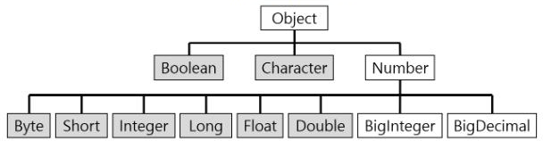
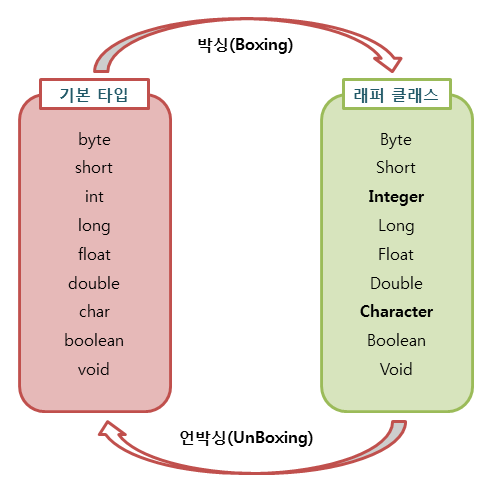

# Wrapper class

#### 왜 사용할까?
- 객체지향 프로그래밍에서 모든 것은 객체로 다루어져야 한다.
- 그렇지만, Java는 성능상의 이유로 8개의 `기본형(Primitive Type)`을 객체로 다루지 않는다.

하지만 매개변수로 객체가 필요하거나, 기본형 값 대신 객체로 저장해야 하거나, 객체 간 비교가 필요하는 등...  
&rarr; **이럴 때 `Wrapper class`를 사용한다.**
- 대표적으로 Java의 `Collection Framework`에서는 Wrapper class를 사용한다.

### Wrapper class란?
: `기본형(primitive type)` 변수를 `감싸거나(wrap)`, `포함하는(contain)` class이다.
- 기본형 값들을 객체로 다루는 일을 가능하게 해준다.
- Wrapper class로 감싸고 있는 기본 타입 값은 외부에서 변경 할 수 없다.
  > 만약 값을 변경하고 싶다면 새로운 포장 객체를 만들어야 한다. &rarr; 불변성을 가진다.
- String형의 경우 **기본 타입을 감싸거나 포함하는 class가 아니므로 wrapper class가 아니다.**

#### Wrapper class의 종류
|Primitive Type|Wrapper Class|
|----|---------|
|char|Character|
|byte|Byte|
|short|Short|
|int|Integer|
|long|Long|
|float|Float|
|double|Double|
|boolean|Boolean|  

### Wrapper Class의 구조


- `wrapper class`들은 모두 `java.lang`패키지에 포함되어 제공된다.
- `Number`: 내부적으로 숫자를 다루는 `wrapper class`들의 부모 클래스


### Boxing 과 UnBoxing


#### Boxing
: 기본 타입의 데이터를 `wrapper class`의 인스턴스로 변환하는 과정
  > Primitive type &rarr; Wrapper class instance

예제 코드
```java
int intA = 1;
Integer integerA = new Integer(intA); // int형인 intA변수를 boxing했다. 
```
#### Unboxing
: `wrapper class`의 인스턴스에 저장된 값을 -> 기본 타입의 데이터로 꺼내는 과정
> Wrapper class instance &rarr; Primitive type

예제 코드
```java
Integer integerA = new Integer(1);
int intA = integerA.intValue();
```

### AutoBoxing & AutoUnBoxing
> JDK 1.5버전부터 boxing,unboxing이 필요한 상황에서 자바 컴파일러가 이를 자동으로 처리해준다.

#### 예시 코드
```java
Integer inteagerA = 1;
int intA = 1;
```