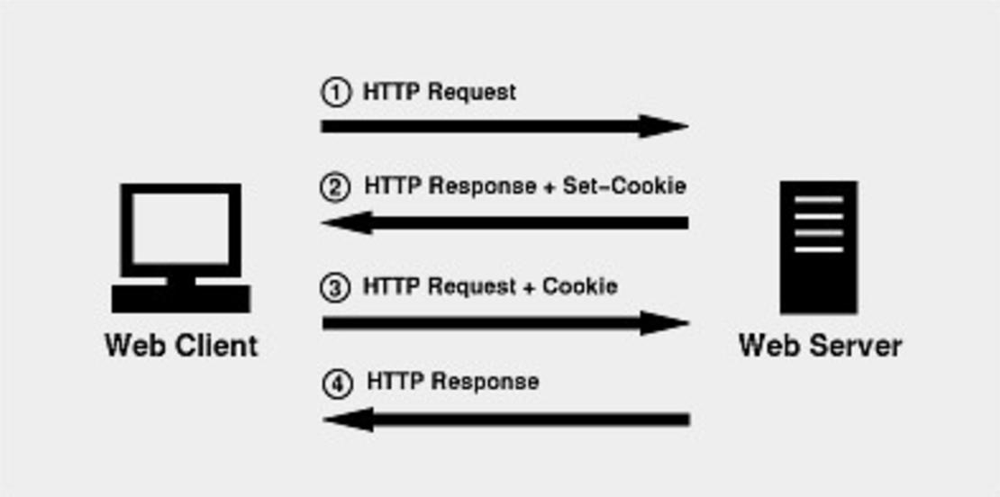
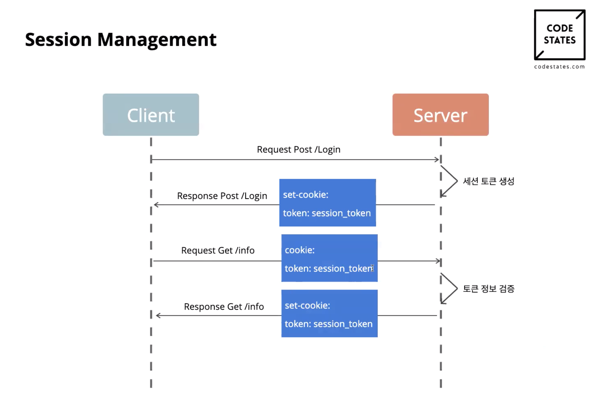

# 쿠키(cookie) 와 세션(session)
### 쿠키(Cookie)와 세션(Session)을 사용하는 이유
- HTTP 프로토콜은 **Connectionless(비연결성)** 과 **Stateless(비상태성)** 라는 특징을 가지고 있다.  
- 모든 사용자의 요청마다 연결과 해제의 과정을 거치면서 연결상태를 유지하지 않고 연결 헤제 후에도 상태 정보를 저장하지 않기 떄문에 **서버의 자원을 크게 절약할 수 있다.**  
- 하지만 **HTTP 프로토콜 만으로 자동로그인, 로그인 상태 유지등 이러한 기능들을 사용할 수 가 없다**  

**이러한 <U>HTTP Connectionless, Stateless 의 특성들을 보완한 기술이 쿠키, 세션 이다.</U>**
## 쿠키(cookie)
**쿠키는 서버가 사용자의 웹 브라우저에 저장하는 데이터이다.** 
>쿠키의 데이터 형태는 Key 와 Value로 구성되고 String으로만 이루어져 있고 4KB 이상 저장할 수는 없다.  
- **Cookie를 이용한 Server-Client 흐름**

### 배경
-  **클라이언트가 정보를 유지하는 Stateful 한 성격의 서비스가 점점 많아짐**  
(로그인을 통해 볼 수 있는 서비스, 장바구니 서비스 등)
- **정보를 유지할 수 없는 Connectionless, Statelses의 성격을 가진 HTTP의 단점을 해결하기 위해** 쿠키라는 개념이 도입됨  
### 사용 목적
1. **세션 관리(Session Management)**
> **로그인, 사용자 닉네임 등 서버가 알아야할 정보들을 저장**
2. **개인화(Personlization)**
> **사용자마다 다르게 그 사람에 적절한 페이지를 보여줄 수 있다.**
3. **트래킹(Tracking)**
> **사용자의 행동과 패턴을 분석하고 기록** 
### 쿠키(cookie) 구성요소
|구성요소|설명|
|------|---|
|`name`|쿠키의 이름|
|`value`|쿠키의 저장된 값|
|`expires`|쿠키가 언제 삭제되는지 결정|
|`domain`|쿠키가 사용되는 도매인을 가짐|
|`path`|쿠키를 반환할 경로를 결정|
|`secure`|보안 연결 설정|
|`httpOnly`|Http외에 다른 통신 사용가능설정|

## 세션(Session)
**비밀번호와 같은 인증 정보를 쿠키에 저장하지 않고 대신에 사용자의 식별자인 ``JSESSIONID(session id)`` 를 저장한다.**
>서버에는 인증 정보와 더불어 이 ID에 해당하는 로그인 상태, 마지막 로그인 시간, 닉네임, 만료기한 등의 정보를 저장한다.  
>보안상 서버는 사용자의 개인 컴퓨터보다는 훨씬 안전하기 때문에 인증에 Session을 이용한다.
### 배경
쿠키의 트래픽 문제와 쿠키를 변경하는 보안적 이슈를 해결하기 위해 등장
### 세션(HTTP Session)?
- **server**:  
    HTTP Session id를 식별자로 구별하여 데이터를 접속한 서버 DB에 정보를 저장(쿠키 형태x)
- **client**:  
    HTTP Session id를 쿠키로 메모리 저장된 형태로 가지고 있다.
- 메모리에 저장하기 떄문에 브라우저가 종료되면 사라짐
### 세션(HTTP Session) 절차
  

1. Client가 서버에 Resource를 요청
2. 서버에서 HTTP Request를 통해 쿠키에서 <code>Sessio-id</code>를 확인을 한 후 없으면 Set-Cookie를 통해 새로 발행할 <code>Session-id</code> 를 보냄
3. Client는 HTTP Request Header에 Session-id를 포함하여 원하는 Resource를 요청
4. Server는 Session-id를 통해 해당 session을 찾아 클라이언트 상태 정보를 유지하여 적절한 응답을 함
### 세션(Session의 특징)
- Session-id는 브라우저 단위로 저장, 브라우저 종료시 소멸
- 각 Client에게 고유 ID를 부여(ex. 로그인한 유저, 로그아웃한 유저)
- 보안 면에서 쿠키보다 우수
- 사용자가 많아질수록 서버 메모리를 많이 차지
### 쿠키와 세션의 차이
- 쿠키와 세션은 비슷한 역활을 하며, 동작원리도 비슷함.(세션도 쿠키 사용)
- 사용자의 정보가 저장되는 위치(Cookie - local, Session - server resource)
- 세션은 쿠키 보안이 유리하다.(쿠키는 local에 저장해 비교적 보안에 취약함)
- 쿠키는 세션보다 빠르다.(세션은 Server에서 처리를 해줘야함)
- 라이프 사이클 (Cookie-만료되어도 남아 있을수 있음, session-만료시간에 상관없이 브라우저 종료되면 삭제)